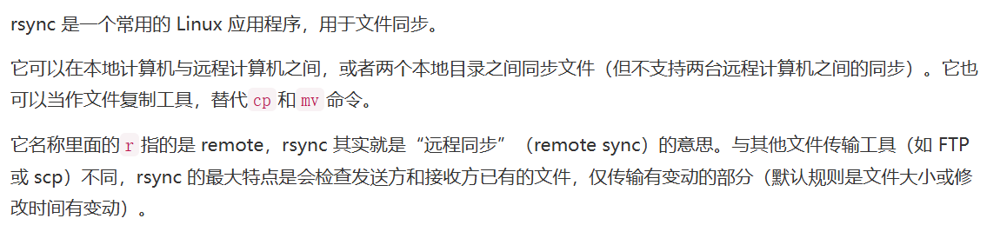

## 常用指令

### du（disk usage）

 

 

 

  

### df（disk free）

 

 

### scp（secure copy）

 

 

 

 

 

### rsync（remote sync）

 

  

 

  

 

  

### ssh-keygen

 

 

  

 

 

 

### cat（concatenate）

 

 

 

### tmux（terminal multiplexer）

  