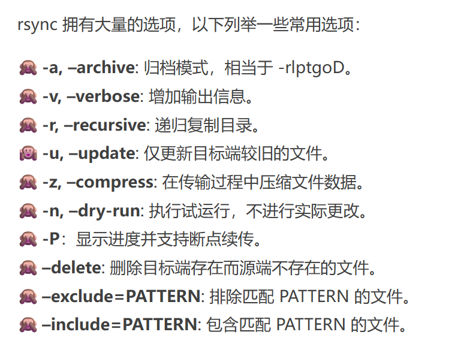
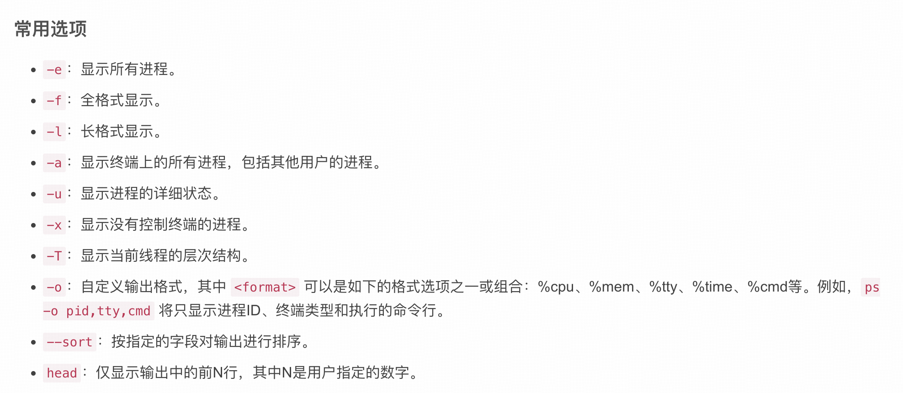

## 常用指令

### du（disk usage）

 

 

 

  

### df（disk free）

 

 

### scp（secure copy）

 

 

 

 

 

### rsync（remote sync）

 

  

 

  

 

  

### ssh-keygen

 

 

  

 

 

 

### cat（concatenate）

 

 

 

### tmux（terminal multiplexer）

  

### ps（process status）



 

 

 

### vim

 

### mv

 

### cp


## git

### commit

```
git commit -m [message]			# 提交暂存区到本地仓库中
```


## NVIDIA 驱动安装

Driver 下载地址：https://www.nvidia.com/en-us/drivers/

fabricmanager下载地址：https://developer.download.nvidia.cn/compute/cuda/repos/ubuntu2004/x86_64/

查看 fabricmanager 版本

```
apt list --installed | grep nvidia-fabricmanager
```

卸载旧版本，安装新版本

```
dpkg -r nvidia-fabricmanager-570   # 卸载旧版本NVIDIA-Fabric Manager
dpkg -r nvidia-fabricmanager-dev-570    # 卸载旧版本Nvidia-Fabric-Manager-devel
wget https://developer.download.nvidia.cn/compute/cuda/repos/ubuntu2004/x86_64/nvidia-fabricmanager-550_550.163.01-1_amd64.deb
dpkg -i nvidia-fabricmanager-550_550.163.01-1_amd64.deb			# 安装目标版本
```

启动 fabricmanager

```
sudo systemctl enable nvidia-fabricmanager   # 配置Fabric Manager服务随实例开机自启动
sudo systemctl start nvidia-fabricmanager    # 启动Fabric Manager服务
sudo systemctl status nvidia-fabricmanager    # 查看Fabric Manager服务是否正常启动，回显active（running）表示启动成功
sudo systemctl unmask nvidia-fabricmanager    # 用于解决Fabric Manager is masked报错
```

