# 常用库和函数

## 语法

 

 

 

 

### zip()

  

## matplotlib

  

 

### imshow

 

### figure,xticks

 

 

 

 

### scatter

  

## Pandas

### 取消输出限制

```python
pd.set_option('display.max_rows', None)  # 显示所有行
pd.set_option('display.max_columns', None)  # 显示所有列
pd.set_option('display.width', None)  # 不限制显示宽度
pd.set_option('display.max_colwidth', None)  # 不限制列宽度
```

## numpy

 

### random.*

```python
# 生成[0,1)均匀分布随机数
np.random.rand(d0,d1,...,dn)
arr = np.random.rand(5,6,7)

# 生成 N(0,1) 标准正态分布随机数
np.random.randn(d0,d1,...,dn)
arr = np.random.randn(5,6,7)

# 生成 [low,high) 随机整数
np.random.randint(low,high)			# 随机均匀采样一个 [low,high) 之间的整数
np.random.randint(low,high,size)			# 随机均匀采样一个元素位于 [low,high),形状为 size 的数组
arr = np.random.randint(0,10,(3,4,5))
```

 

 

 

### full,eye,slices

 

 

  

### add.at()

 

### array,ndarray,asarray

 

 

 

### argpartition,nsmallest

 

 

### linalg.norm()

 

### maximum,minimum,fmax

 

### unique()

 

  

### array_split()

 

 

### concatenate/vstack/hstack

 

 

## Pytorch

 

### clamp()/clip()

 

### transpose

 

### unsqueeze() / squeeze()

 

### numel()

 

### shape,size()

 

### torchsummary.summary()

 

### torch.mm / bmm / matmul

 

### torch.outer()

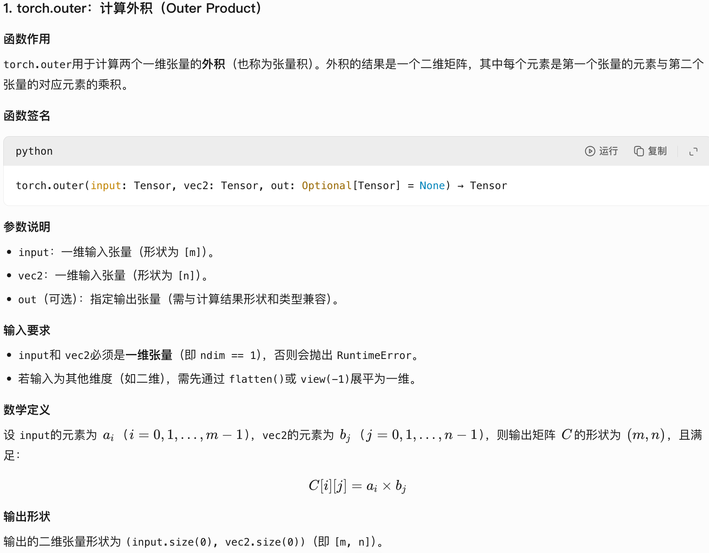 

```python
# 定义两个向量
a = torch.tensor([1, 2, 3])
b = torch.tensor([4, 5])

# 计算外积
result = torch.outer(a, b)
# tensor([[ 4,  5],
#         [ 8, 10],
#         [12, 15]])
```

### torch.polar

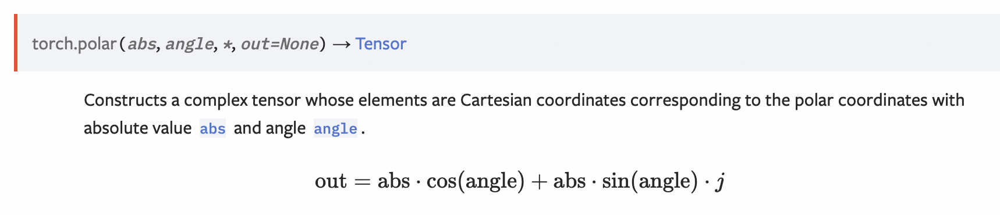 

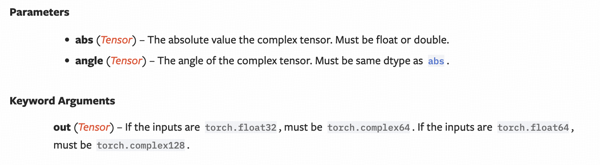 

 ```python
 # 定义模和相角
 magnitude = torch.tensor([1.0, 2.0])
 angle = torch.tensor([0.0, math.pi / 2])
 
 # 转换为复数
 complex_result = torch.polar(magnitude, angle)
 # 输出:
 # tensor([1.0000e+00 + 0.0000j, 0.0000e+00 + 2.0000j])
 ```

### register_buffer / nn.Parameter

 

### nn.optim

 

### nn.ModelList

 

## Scipy

 

### scipy.stats.norm.cdf()

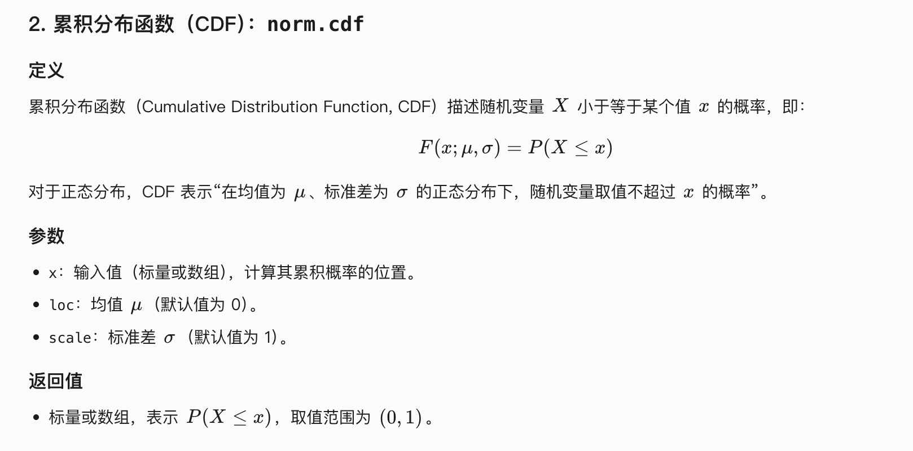 

```python
from scipy.stats import norm

# 标准正态分布（μ=0, σ=1）
print(norm.cdf(0))    # 输出 0.5（均值处累积概率为50%）
print(norm.cdf(1.96)) # 输出约 0.975（约97.5%的概率小于1.96）
print(norm.cdf(-1))   # 输出约 0.1587（约15.87%的概率小于-1）

# 非标准正态分布（μ=5, σ=2）
print(norm.cdf(7, loc=5, scale=2))  # 等价于标准正态分布的Z=(7-5)/2=1，输出约0.8413
```

### scipy.stats.norm.ppf()

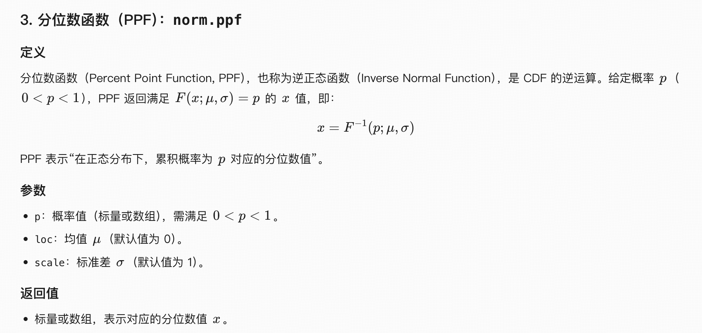 

```python
from scipy.stats import norm

# 标准正态分布（μ=0, σ=1）
print(norm.ppf(0.5))    # 输出 0（50%分位数是均值）
print(norm.ppf(0.975))  # 输出约 1.96（97.5%分位数，常用置信水平）
print(norm.ppf(0.025))  # 输出约 -1.96（2.5%分位数）

# 非标准正态分布（μ=5, σ=2）
print(norm.ppf(0.8413, loc=5, scale=2))  # 等价于Z=1时的x值，输出7（因为Φ(1)=0.8413）
```

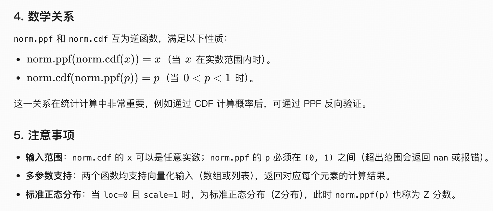 

## Json

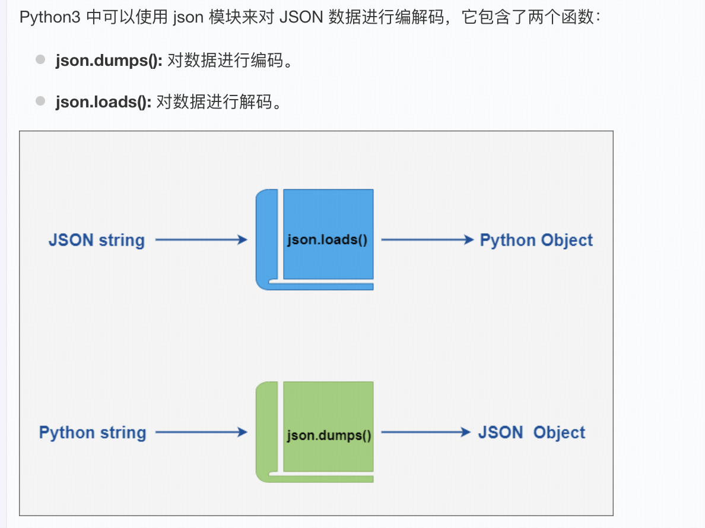  

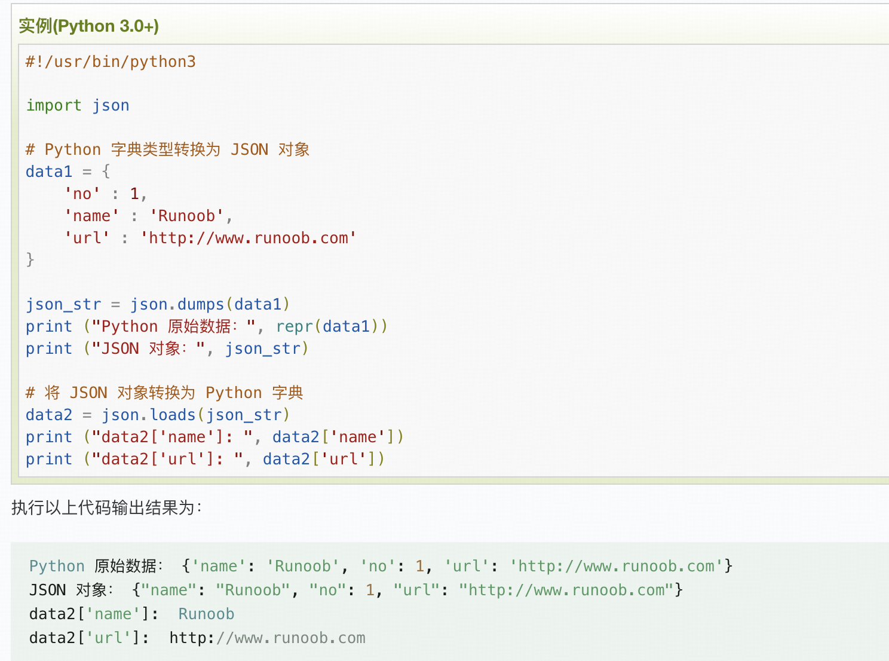 

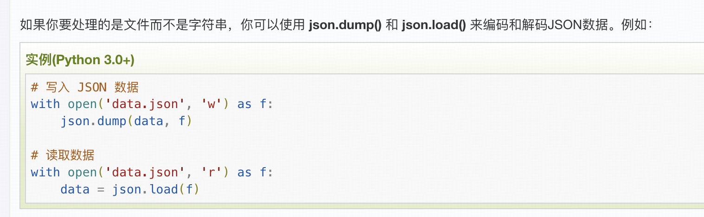 

## datetime

## warnings

### filterwarnings

```python
import warnings
warnings.filterwarnings(action, message="")
```

- Message 是一个正则表达式，匹配警告消息的开头；不区分大小写。
- Category 是 Warning 的一个子类，用来指定要作用的警告类型。
- module 是一个正则表达式，匹配要作用的库的名称。

**Action：**

- "error"：将匹配警告转换成异常。
- "ignore"：忽略匹配的警告
- "always"：始终输出匹配的警告
- "default"：对于同样的警告只输出第一次出现的警告
- "module"：打印第一次出现的匹配发出警告的每个位置（模块 +行号）的警告
- "once"：输出第一次出现的警告，而不考虑它们的位置

## GIL

**Global Interpreter Lock** **全局解释器锁**

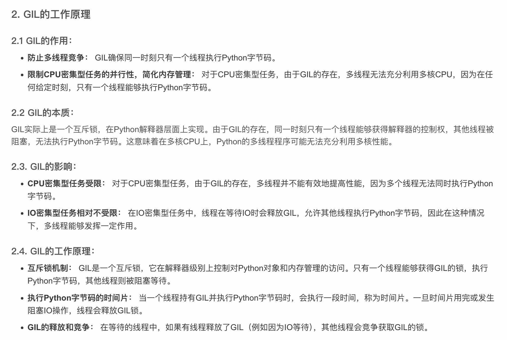 

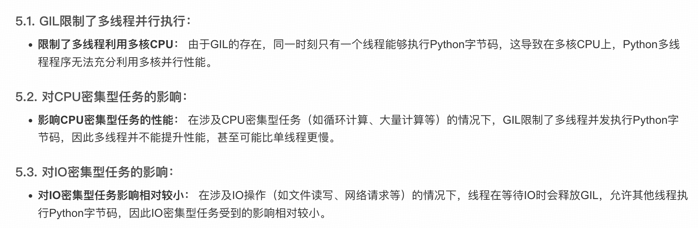 

## asyncio

 

### asyncio.gather()

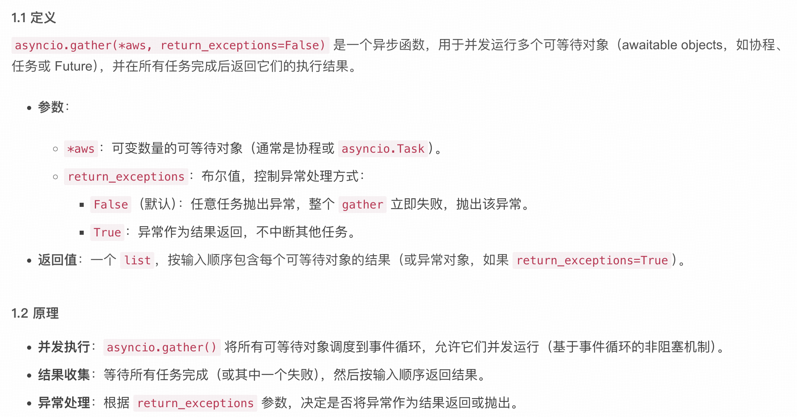  

### loop.run_in_executor()

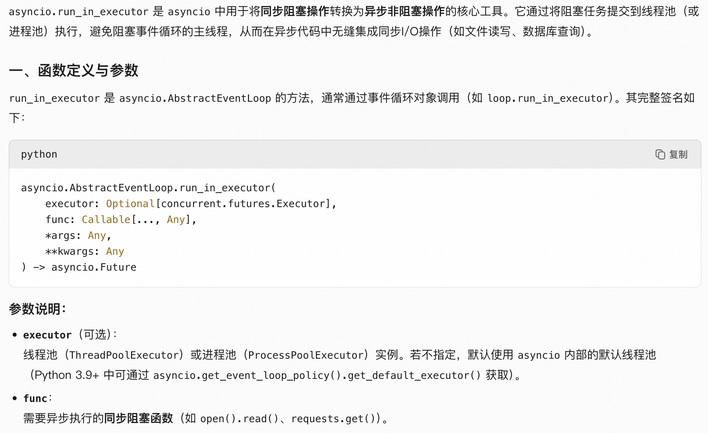 

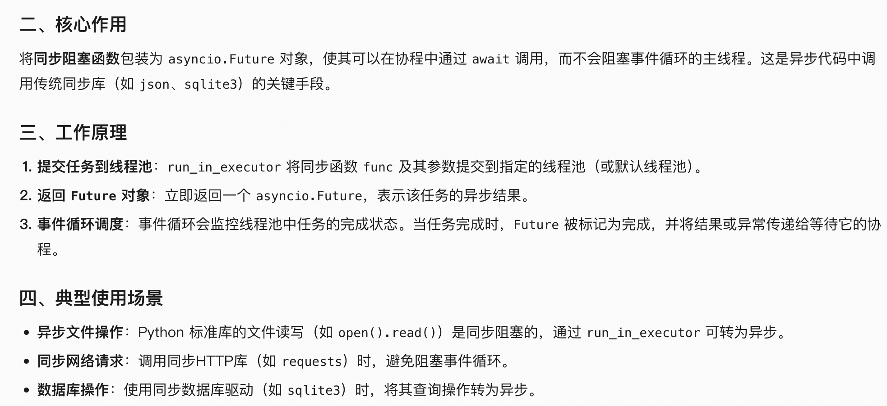 

```python
def sync_read_file(file_path: str) -> str:
    # 同步阻塞的函数
    for i in range(3):
        time.sleep(1)
        print(f"Reading file {file_path} {i}")
    return file_path

async def async_read_file(loop: asyncio.AbstractEventLoop, file_path: str) -> str:
    # 提交同步任务到线程池，返回 Future
    future = loop.run_in_executor(None, sync_read_file, file_path)
    return await future

async def main():
    loop = asyncio.get_event_loop()
    t1 = loop.run_in_executor(None, sync_read_file, "file1.txt")
    t2 = loop.run_in_executor(None, sync_read_file, "file2.txt")
    t3 = asyncio.to_thread(sync_read_file, "file3.txt")
    t4 = asyncio.to_thread(sync_read_file, "file4.txt")
    t5 = async_read_file(loop, "file5.txt")
    t6 = async_read_file(loop, "file6.txt")
    await asyncio.gather(t1, t2, t3, t4, t5, t6)

if __name__ == "__main__":
    asyncio.run(main())
```

### asyncio.to_thread()

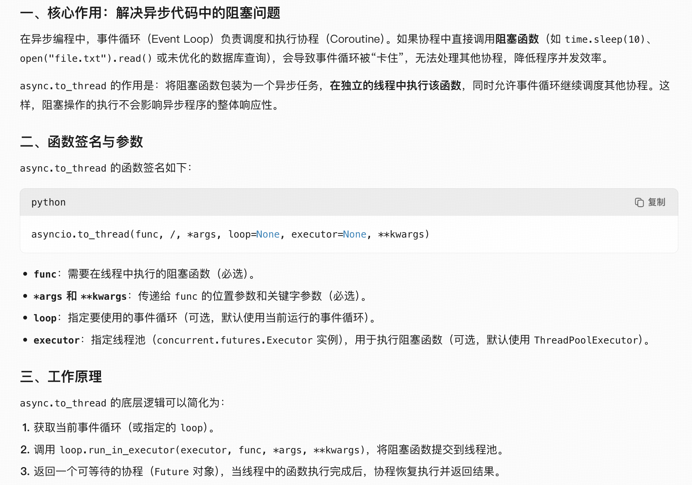 

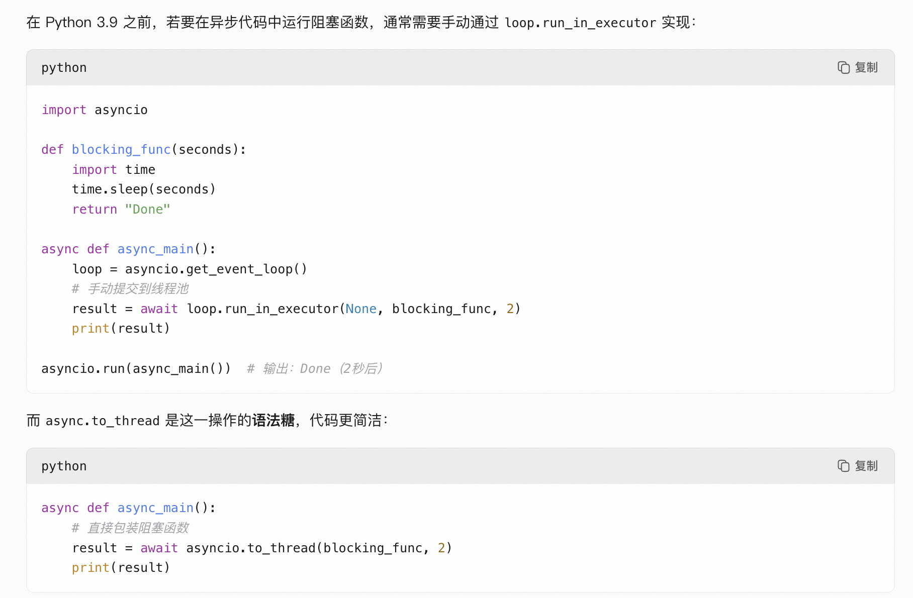 

# 装饰器

## @property

- 将类的方法转换为只读属性，在不改变类接口的情况提供一种方式访问计算出的属性。
- 一般是只读的，如果需要修改，通过定义 @propertyName.setter 和 @propertyName.deleter 来控制属性的更改和删除。

```python
class Circle:
    def __init__(self, radius):
        self._radius = radius

    @property
    def radius(self):
        return self._radius

    @radius.setter
    def radius(self, value):
        if value < 0:
            raise ValueError("Radius cannot be negative")
        self._radius = value

    @property
    def area(self):
        import math
        return math.pi * (self._radius ** 2)

# 使用示例
c = Circle(5)
print(c.radius)  # 5
print(c.area)    # 78.53981633974483

c.radius = 10
print(c.area)    # 314.1592653589793

# c.area = 200  # AttributeError: can't set attribute
```

# Pytorch

## 分布式训练

### launch

- 启动脚本

```
torch.distributed.launch
```

