[TOC]

# 机器学习

## 支持向量机

**Support Vector Machine(SVM)**

  

 

## 决策树

### 算法

 

决策树的生成是一个递归过程。在决策树基本算法中，有三种情形会导致递归返回: 

(1) 当前结点包含的样本全属于同一类别，无需划分; 

(2) 当前属性集为空，或是所有样本在所有属性上取值相同，无法划分; 

(3) 当前结点包含的样本集合为空，不能划分.

在第(2)种情形下，我们把当前结点标记为叶结点，井将其类别设定为该结点所含样本最多的类别;在第 (3) 种情形下，同样把当前结点标记为叶结点，将其类别设定为其父结点所含样本最多的类别.注意这两种情形的处理实质不同：情形(2) 是在利用当前结点的后验分布，而情形(3) 则是把父结点的样本分布作为当前结点的先验分布. 

### 信息增益

 

### CART

**Classification and Regression Tree，分类与回归树**

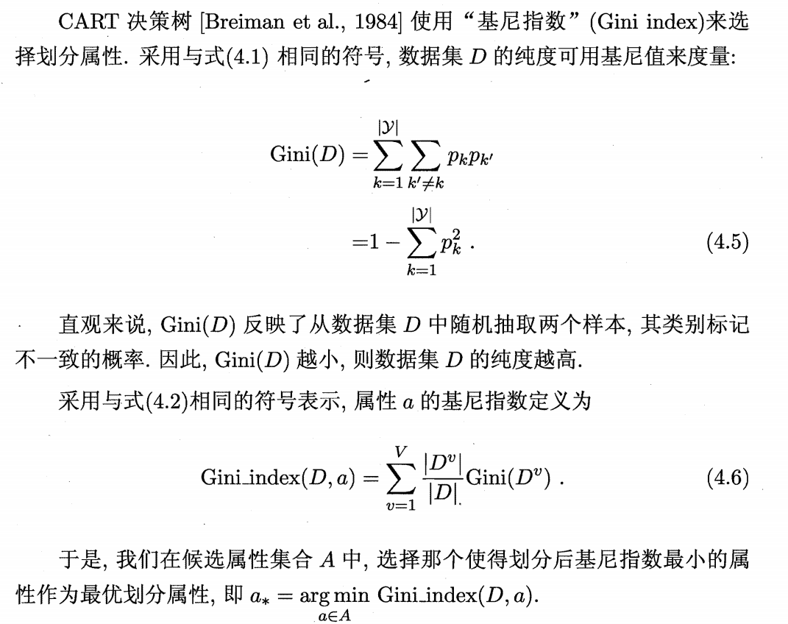 

### 剪枝  

 

## 集成学习

### Boosting

 

#### GBDT

**Gradient Boosting Decision Tree，梯度提升决策树**

- 集成 K 个 CART 进行预测，其中第 k 个 CART 记为 $T_k$。

- 是一种加法模型，第 k 个 CART 预测前 k-1 个模型的残差，把所有模型的预测值累加起来作为最后的预测值。

  $f_k(x)=\sum\limits_{i=1}^kT_i(x)=f_{k-1}(x)+T_k(x)$

- 第 k 个 CART 的目标函数为 $J=\sum\limits_{i=1}^{N}\mathcal{L}(y_i,f_k(x_i))=\sum\limits_{i=1}^{N}\mathcal{L}(y_i,f_{k-1}(x_i)+T(x_i))$，$\mathcal{L}$ 一般是 MSE。

  $f_{k-1}$ 的梯度是 $\frac{\partial J}{\partial f_{k-1}}$，沿梯度下降方向走一小步会使得损失函数变小，设学习率为 $\alpha$，得到 $f_k(x)=f_{k-1}(x)-\alpha \frac{\partial J}{\partial f_{k-1}}$.
  
  即 $T_k(x)=-\alpha \frac{\partial J}{\partial f_{k-1}}$.

- 当 $\mathcal{L}$ 是 MSE 时，$J=(y-f_k(x))^2\Longrightarrow \frac{\partial J}{\partial f_k}=-2(y-f_k(x))$

  得到 $T_k(x)=-\alpha\frac{\partial J}{\partial f_{k-1}}=2\alpha(y-f_{k-1}(x))$，说明 $T_k$ 的拟合目标为前 k-1 个 CART 留下的残差 $y-f_{k-1}(x)$

- 缺点：串行生成，难以并行加速

#### XGBoost

**eXtreme Gradient Boosting，极致梯度提升**

- 基于 GBDT 做了如下改进
  - **二阶泰勒展开：**GBDT 只用了损失函数的一阶台了展开，XGBoost 使用损失函数的二阶泰勒展开进行近似，使得优化过程更加精确高效。
  - **正则化：**在目标函数中加入了正则项，控制模型的复杂度，降低了模型的方差，防止过拟合。正则项中包含了树的叶子节点个数、叶子节点权重的 L2 范数。
  - **并行：**GBDT 不支持并行，XGBoost 在 Tree 粒度不支持并行，但是**支持特征粒度和数据粒度的并行**。
  - **自定义损失函数：**支持自定义目标函数，只需要函数支持一阶和二阶求导。

### Bagging

 

### 随机森林

**Random Forest (RF)**

- 在以决策树为基学习器构建 Bagging 集成的基础上，进一步在决策树的训练过程中引入了随机属性选择.

- 传统决策树在 $d$ 个属性中选择一个最优属性进行划分，RF 先选择一个包含 $k$ 个属性的子集，再选择子集中的最优属性。

   $k=d$ 时，与传统决策树相同；$k=1$ 时，随机选择一个属性划分；一般推荐 $k=\log_2d$

## 数值优化

### 前置知识

**泰勒定理：**

- 如果 $f:\mathbb{R}^n \rightarrow \mathbb{R}$ 是连续可微函数，对于 $p\in \mathbb{R}$ ，存在 $t\in(0,1)$ 满足：

  $f(x+p)=f(x)+\nabla f(x+tp)^Tp$

- 如果 $f$ 为二阶连续可微函数，则有：**（Why？？？？？？？？？？）**

  $\nabla f(x+p)=\nabla f(x) +\int_{0}^{1}\nabla^2f(x+tp)p\mathrm{d}t$

  $f(x+p)=f(x)+\nabla f(x)^Tp+\frac{1}{2}p^T\nabla^2f(x+tp)p,\ \ \ t\in(0,1)$

**一阶必要条件：**

- 如果 $x^*$ 为局部极小点，并且 $f$ 在 $x^*$ 的开邻域内连续可微，则有 $\nabla f(x^*)=0$。

**二阶必要条件：** **（Why？？？？？？？？？？）**

- 如果 $x^*$ 为局部极小点，并且 $\nabla^2f$ 在 $x^*$ 的开邻域内连续，则有 $\nabla f(x^*)=0$ 并且 $\nabla^2f(x^*)$ **半正定**。

**二阶充分条件：** **（Why？？？？？？？？？？）**

- 如果 $\nabla^2f$ 在 $x^*$ 的开邻域内连续，并且 $\nabla f(x^*)=0$ 和 $\nabla^2f(x^*)$ **正定**，则 $x^*$ 是 $f$ 的**严格局部极小点**。
- 注意：不是充要条件

### 无约束优化

- 形式为：$\min{f(x)}$

  $x$ 是 $n$ 维实数向量，$f:\mathbb{R}^n\rightarrow \mathbb{R}$ 为光滑目标函数

#### 线搜索

- 第 $k$ 次迭代首先确定移动方向 $p_k$，再确定移动多少距离 $\alpha$，即在沿着 $p_k$ 的一维空间里搜索 $\min_{\alpha>0}f(x_k+\alpha p_k)$. 我们不需要精确求解最小值，只需要 $x_{k+1}$ 比 $x_k$ 有一定程度的进步即可。如何确定搜索方向 $p_k$ 是各个算法的核心。
- 确定 $p_k$ 分为四种方法：**最速下降方向、牛顿方向、拟牛顿方向、共轭梯度方向**。

**最速下降方向：**

- 梯度是上升最快的方向，最速下降方向就是梯度的反方向。
- $p_k=-\nabla f(x_k)$

**牛顿方向：**

- 最速下降方向只是相对于当前位置的短期方向，而不是直接向着最优解的直接方向。牛顿方向利用了二阶信息黑塞矩阵 $H_k=\nabla^2f(x_k)$，通常可以取得比最速下降方向更好的结果。
- $p_k=-H_k^{-1}\nabla f(x_k)$

### 凸优化

**凸集：**

- $C$ 是凸集，如果对于任意 $x,y\in C$ 和任意 $0\le \theta\le 1$，$\theta x+(1-\theta )y \in C$ 恒成立
- 直观来说，任取集合内的两点连成一条线段，如果线段完全落在集合中，那么这个集合就是凸集

**凸函数：**

- 定义在 $\mathbb{R}^n\rightarrow \mathbb{R}$ 上的函数 $f$ 是凸函数，如果它的定义域 $\mathbb{D}(f)$ 是一个凸集，且对任意 $x,y\in \mathbb{D}$ 和任意 $0\le \theta \le 1$，$f(\theta x+(1-\theta)y)\le \theta f(x)+(1-\theta)f(y)$ 恒成立。

- 一阶充要条件：

  假设函数 $f$ 可微，则 $f$ 是凸函数当且仅当 $f$ 的定义域 $\mathbb{D}(f)$ 是凸集，且对于所有 $x,y\in \mathbb{D}(f)$ 均满足

  $f(y)\ge f(x)+\nabla f(x)^T(y-x)$

  几何意义：定义域内的所有函数值都大于等于这个点的一阶近似。

  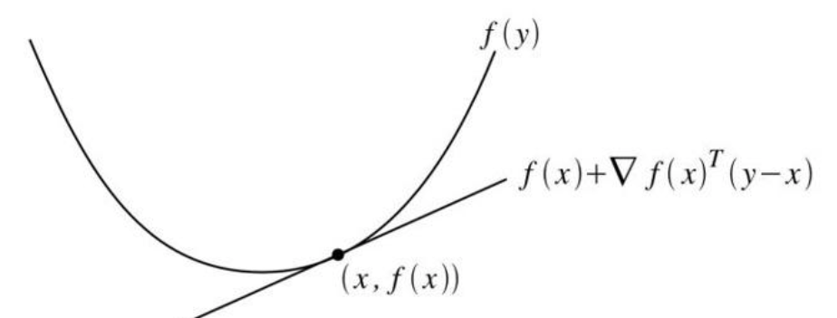 

**凸优化问题：**
$$
\begin{align*}\min\ \ \ & f(x)\\s.t.\ \ \ &g_i(x)\le0,i=1,2,...,m\\&h_j(x)=0,j=1,2,...,n\end{align*}
$$
当 $f(x)$ 和 $g_i(x)$ 均为凸函数，$h_j(x)$ 均为仿射函数时，上述问题为凸优化问题。

**求解凸优化问题：**

- 凸优化问题具有局部最优解即全局最优解的特性，求解过程可以简化为：找到一个点列，使得目标函数的值持续减小，直到触发停止条件或者达到最小值。

- 设 $x_k$ 为第 $k$ 次迭代的解，$d_k$ 为第 $k$ 次的搜索方向，$\alpha_k$ 为第 $k$ 次迭代的步长，则第 $k$ 次迭代公式为：

  $\begin{align*}& x_{k+1}=x_k+\alpha_k d_k \\s.t.\ \ \ &\nabla f(x_k)^Td_k<0\\&f(x_{k+1})= f(x_k+\alpha_k d_k)<f(x_{k})\end{align*}$

## 过拟合/欠拟合

### 过拟合原因

- 样本量不足
- 模型能力太强，把噪声也拟合了
- 数据中噪声太多，噪声被当成一种特征被拟合

### 过拟合解决方法

- 加数据
- 加 dropout
- 加正则化，约束参数大小
- 早停：当验证集误差大于测试集误差且呈上升趋势时停止训练。

### 欠拟合原因

- 模型复杂度不够，能力不够强
- 特征量不足
- 正则化强度过大限制了模型的学习能力

### 欠拟合解决方法

- 使用更复杂的模型，加深加宽加参数
- 特征挖掘，使用强表达能力的特征
- 减小正则化系数

## 精度

浮点数精度：双精度(FP64)，单精度(FP32，TF32)，半精度(FP16，BF16)，8位精度(FP8)，4位精度(FP4，NF4)

量化精度：INT8、INT4

| 数据类型 | Bits   | 符号位S | 指数位E | 尾数位M | 数值范围                       | 数值精度  |
| -------- | ------ | ------- | ------- | ------- | ------------------------------ | --------- |
| FP64     | 64     | 1       | 11      | 52      |                                |           |
| FP32     | 32     | 1       | 8       | 23      | $-3.4*10^{38}\sim 3.4*10^{38}$ | $10^{-6}$ |
| TF32     | **19** | 1       | 8       | 10      | $-3.4*10^{38}\sim 3.4*10^{38}$ | $10^{-3}$ |
| FP16     | 16     | 1       | 5       | 10      | $-6.5*10^4\sim 6.5*10^{4}$     | $10^{-3}$ |
| BF16     | 16     | 1       | 8       | 7       | $-3.4*10^{38}\sim 3.4*10^{38}$ | $10^{-2}$ |
| FP8 E4M3 | 8      | 1       | 4       | 3       |                                |           |
| FP8 E5M2 | 8      | 1       | 5       | 2       |                                |           |
| FP4      | 4      | 1       | 2       | 4       |                                |           |

- 大部分深度学习框架**默认使用 FP32**，FP32 可以作为精度 baseline

 

 

  

## 正则化（Regularization）

 

## 归一化（Normalization）

### RMS Norm

**Root mean square Norm**
$$
\mathrm{RMSNorm}(x)=\gamma \odot\frac{x}{\sqrt{\mathrm{mean}(x^2)}+\epsilon}
$$


- $x$：输入向量
- $\mathrm{mean}(x^2)$：向量元素的平方均值
- $\epsilon$：极小值（如 $10^8$），防止分布为零。
- $\odot$：逐元素相乘。
- $\gamma$：可学习的缩放参数（和输入同维）

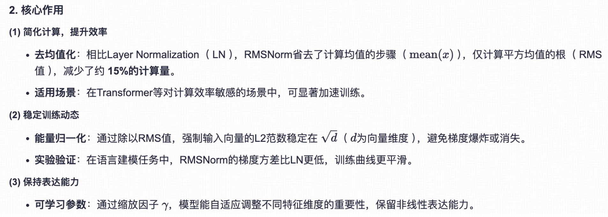

 

### Batch Norm

- 在 batch 维度做归一化，保留了每个特征在不同样本之间的大小关系，但是抹杀了同一样本在不同特征之间的大小关系。
- 在推理时的均值方差需要固定，用的是训练时所有均值方差的 **EMA**

### Layer Norm

- 在 hidden 维度做归一化，保留了每个样本不同特征之间的大小关系，但是抹杀了同一特征在不同样本之间的大小关系。

### QK Norm

## 激活函数

### Sigmoid

$$
\mathrm{sigmoid}(x)=\frac{1}{1+e^{-x}}
$$

- 导数表达式为 $f'(x)=f(x)(1-f(x))$

 

### Tanh

$$
\begin{align*}
\mathrm{Tanh}(x)&=\frac{e^x-e^{-x}}{e^x+e^{-x}}\\
&=2\mathrm{sigmoid}(2x)-1
\end{align*}
$$


  

### Swish

$$
\mathrm{Swish}(x)=x\cdot \mathrm{sigmoid}(\beta x)
$$


 

### GELU

 

 

### SwiGLU

 

 

## 优化器

### SGD

### Adam

## 损失函数

### Cross Entropy

$$
L(\hat{y})=-\sum{y\log{\hat{y}}}
$$

- $-\log$ 操作把概率空间转换到信息空间，真实 label 的预测概率越接近 1，蕴含的不确定信息越少，损失越接近 0。

### InfoNCE

$$
L_q=-\log{\frac{\exp(q\cdot k_+/\tau)}{\sum_{i=1}^{N} \exp(q\cdot k_i)/\tau}}
$$

- $q$ 是已经编码好的特征 query，$k_1,k_2...k_N$ 是已经编码好的样本，其中 $k_+$ 是和 $q$ 匹配的正样本，其他是负样本。

- $\tau$ 是温度系数，当 $\tau = 1$ 时，InfoNCE 就是交叉熵损失。

  当温度系数变大，$qk/\tau$ 减小，logits 分布变平滑，模型对负样本一视同仁，容易导致区分力不足

  当温度系数变小，$qk/\tau$ 增大，logits 分布更尖锐，模型更关注相似度高的样本。

- 通常用于对比学习，例如 CLIP, MoCo。

## 聚类

### 外部指标

将聚类结果与某个"参考模型"进行比较

 

 

 

### 内部指标

直接考察聚类结果而不利用任何参考模型。

 

 

### k 均值算法

 

 

### 学习向量量化(LVQ)

**Learning Vector Quantization**

 

### DBSCAN

**Density-Based Spatial Clustering of Applications with Noise**

 

 

 

## 概率图模型

 

 

 

### HHM

### CRF

## PCA降维

 

 

   

 

 

# 深度学习

## 自编码器

 


 

 

### 重参数化(reparameterization)

 

 

```python
class VAE(nn.Module):
    def __init__(self, input_dim, latent_dim):
        super(VAE, self).__init__()
        # 编码器部分
        self.fc1 = nn.Linear(input_dim, 512)
        self.fc21 = nn.Linear(512, latent_dim)  # 均值
        # 由于方差不能为负，所以这里输出的是log(方差)，而不是方差本身.
        self.fc22 = nn.Linear(512, latent_dim)  # 对数方差
 
        # 解码器部分
        self.fc3 = nn.Linear(latent_dim, 512)
        self.fc4 = nn.Linear(512, input_dim)
 
    def encode(self, x):
        h1 = F.relu(self.fc1(x))
        return self.fc21(h1), self.fc22(h1)
 
    def reparameterize(self, mu, logvar):
        std = torch.exp(0.5 * logvar)
        eps = torch.randn_like(std)  # 从标准正态分布N(0, 1)中采样
        return mu + eps * std  # 重参数化公式
 
    def decode(self, z):
        h3 = F.relu(self.fc3(z))
        return torch.sigmoid(self.fc4(h3))  # 使用sigmoid激活函数输出到[0, 1]区间
 
    def forward(self, x):
        mu, logvar = self.encode(x.view(-1, 784))
        z = self.reparameterize(mu, logvar)
        return self.decode(z), mu, logvar
```

## 图神经网络GNN

 

### GCN

 

 

 

 


## 扩散模型

### DDPM

[[2006.11239] Denoising Diffusion Probabilistic Models](https://arxiv.org/abs/2006.11239)

  

**前向传播：**

- 前向传播可以视为马尔可夫过程，$t$ 时刻的图像 $x_t$ 只和 $x_{t-1}$ 有关。

  $q(x_{1:T}|x_0)=\prod_{t=1}^{T}q(x_{t}|x_{t-1})$，$q(x_{1:T}|x_0)$ 表示从 $x_0$ 开始添加 $T$ 次噪声后，图像的概率分布。

- $q(x_t|x_{t-1}) = N(x_{t-1};\sqrt{1-\beta_t}\cdot x_{t-1},\beta_tI)$

  建模每一步加噪的条件概率分布，是一个 $H\cdot W\cdot C$ 维度的高斯分布，均值是 $\sqrt{1-\beta_t}\cdot x_{t-1}$，协方差矩阵是 $\beta_tI$，每个时间步的值 $x_t$ 采样自这个高斯分布。

  $I$ 是一个 $HWC\times HWC$ 维度的单位矩阵，表示各维度独立，每个维度的方差都是 $\beta_t$。

- $\beta_t$ 用于控制每个时间步向数据中添加噪声的量。不同时间下的 $\beta_t$ 是预先定义好的，随时间递增，可以是Linear，Cosine等。满足 $\beta_1<\beta_2<...<\beta_T$。

  在扩散过程的早期，我们希望对数据添加较少的噪声，从而最大程度保留数据的原始结构；而在扩散过程的后期，我们则希望通过添加更多的噪声将数据逐渐转化为一个接近高斯分布的形式。

- 定义 $\alpha_t = 1-\beta_t$，$\overline{\alpha_t}=\prod_{i=1}^{t}\alpha_i$，推导得到

   $q(x_t|x_0)=N(x_t;\sqrt{\overline{\alpha_t}}\cdot x_0,(1-\sqrt{\overline{\alpha_t}})I)$.

 

**训练过程：**

- 从数据中抽取一个样本 $x_0$
- 随机选取一个时间步 $t\in [1,T]$
- 随机采样 $\epsilon \sim \mathcal{N}(0, \mathbf{I})$
- 计算 $x_0$ 加噪后的图像 $x_t=\sqrt{\overline{\alpha_t}}\cdot x_0+\sqrt{1-\overline{\alpha_t}}\cdot \epsilon$
- 通过训练好的 Unet 模型 $\epsilon_\theta$，预测在时间步 $t$ 对应的噪声 $\epsilon_\theta(x_t, t)$
- 计算 Unet 预测噪声和随机噪声的 L2 损失，计算梯度，更新模型

### DDIM

[[2010.02502] Denoising Diffusion Implicit Models](https://arxiv.org/abs/2010.02502)


### Stable Diffusion

[[2112.10752] High-Resolution Image Synthesis with Latent Diffusion Models](https://arxiv.org/abs/2112.10752)

 

**创新：**

- 加入 AutoEncoder，使得扩散过程在 latent space 下执行，提高图像生成的效率。
- 加入条件控制机制，能够使用其他模态的数据控制图像的生成，其中条件生成控制通过 Cross Attention 机制实现。

**三大组件： VAE、U-Net、CLIP Text Encoder **

### DiT

**Diffusion Transformer**

[[2212.09748] Scalable Diffusion Models with Transformers](https://arxiv.org/abs/2212.09748)

 

### SDXL

[[2307.01952] SDXL: Improving Latent Diffusion Models for High-Resolution Image Synthesis](https://arxiv.org/abs/2307.01952)

 

- Stable Diffusion XL 是一个**二阶段的级联扩散模型**，包括 Base 模型和 Refiner 模型。
- Base模型的主要工作和Stable Diffusion 1.x-2.x一致，具备文生图、图生图、图像inpainting 等能力。
- 在Base模型之后，级联了Refiner模型，也是一个扩散模型，**对Base模型生成的图像Latent特征进行精细化提升，其本质上是在做图生图的工作**。

 

### SD3

https://arxiv.org/abs/2403.03206

**创新点：**

- 基于 **Rectified Flow（RF，整流）**改进的生成模型框架 **Flow Matching**
- 新的可扩展的全 Transformer 的 MM-DiT 架构

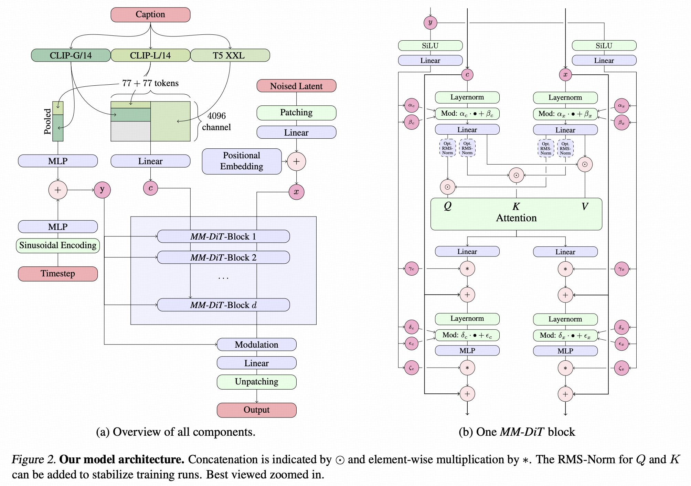 


## 卷积神经网络

**Convolutional Neural Network(CNN)**

### 深度可分离卷积（DSC）

 

 

 

 

## 循环神经网络

**Recurrent Neural Network，RNN**

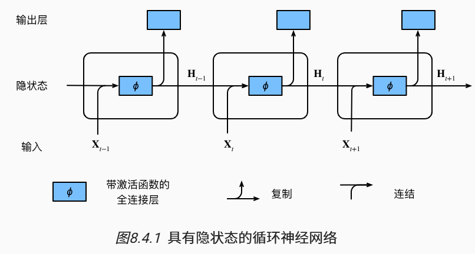 

-  设时间步 $t$ 有隐藏变量 $\mathrm{H}_t\in\mathbb{R}^{n\times h}$ 和输入 $\mathrm{X}_t\in \mathbb{R}^{n\times d}$，有

  $\mathrm{H}_t=\phi(\mathrm{X}_{t-1}\mathrm{W}_{xh}+\mathrm{H}_{t-1}\mathrm{W}_{hh}+\mathrm{b}_{h})$

  时间步 $t$ 的输出为 $\mathrm{O}_t=\mathrm{H_t}\mathrm{W}_{hq}+\mathrm{b}_{q}$

  

### LSTM

**Long Short Term Memory，长短期记忆网络**

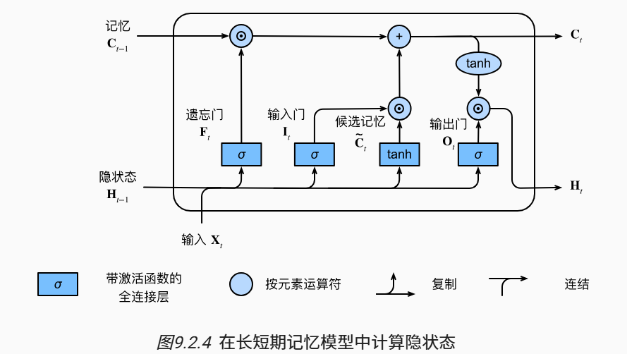 

# Transformer架构

## Transformer

 

## BERT

**Bidirectional Encoder Representation from Transformers**

 

Embedding由三种Embedding求和而成：

Token Embeddings是词向量，第一个单词是CLS标志，可以用于之后的分类任务

Segment Embeddings用来区别两种句子，因为预训练不光做LM还要做以两个句子为输入的分类任务

Position Embeddings和之前文章中的Transformer不一样，不是三角函数而是学习出来的

 

 

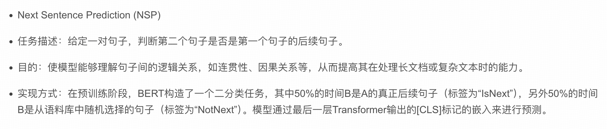

```python
class BERTLM(nn.Module):
    """
    BERT Language Model
    Next Sentence Prediction Model + Masked Language Model
    """

    def __init__(self, bert: BERT, vocab_size):
        """
        :param bert: BERT model which should be trained
        :param vocab_size: total vocab size for masked_lm
        """

        super().__init__()
        self.bert = bert
        self.next_sentence = NextSentencePrediction(self.bert.hidden)
        self.mask_lm = MaskedLanguageModel(self.bert.hidden, vocab_size)

    def forward(self, x, segment_label):
        x = self.bert(x, segment_label)
        return self.next_sentence(x), self.mask_lm(x)


class NextSentencePrediction(nn.Module):
    """
    2-class classification model : is_next, is_not_next
    """

    def __init__(self, hidden):
        """
        :param hidden: BERT model output size
        """
        super().__init__()
        self.linear = nn.Linear(hidden, 2)
        self.softmax = nn.LogSoftmax(dim=-1)

    def forward(self, x):
        return self.softmax(self.linear(x[:, 0]))


class MaskedLanguageModel(nn.Module):
    """
    predicting origin token from masked input sequence
    n-class classification problem, n-class = vocab_size
    """

    def __init__(self, hidden, vocab_size):
        """
        :param hidden: output size of BERT model
        :param vocab_size: total vocab size
        """
        super().__init__()
        self.linear = nn.Linear(hidden, vocab_size)
        self.softmax = nn.LogSoftmax(dim=-1)

    def forward(self, x):
        return self.softmax(self.linear(x))
```

## GPT

## Attention

$$
\mathrm{Attention}(Q,K,V)=\mathrm{softmax}(\frac{QK^T}{\sqrt{d_k}})V
$$

- 多头注意力中的 $d_k$ 指每个头的维度，而不是拆头之前的 hidden_size。
- dropout 位置：在 softmax 之后，乘 V 之前，即随机挑选部分位置不进行关注（重要度矩阵为 0）。

### Self Attention

  


### Cross Attention

 

- 与 Self-Attention 不同，Self-Attention 是让一个序列自己内部的元素相互关注（比如一个句子中的单词互相计算关系），而 Cross Attention 则是让**两个不同的序列**之间建立关注关系。

- Cross Attention 的核心在于：它允许一个序列（称为 Query，查询）去关注另一个序列（称为 Key 和 Value，键和值），从而实现信息的融合，通常是**需要生成和理解的目标序列 Query** 去关注**提供上下文或背景的源序列 Key/Value**。

- 示例
  - 机器翻译：
    - Query（Decoder）：当前生成的单词
    - Key/Value（Encoder）：输出的源语言句子
    - Cross：解码器生成目标语言时，关注源语言的每个单词，决定当前应该翻译什么。
  - 图像字幕：
    - Query：语言模型当前生成的单词
    - Key/Value：图像特征（CNN 或 ViT）提取
    - Cross：模型在生成描述时，关注图像的不同区域
  - 视觉问答：
    - Query：输入的问题
    - Key/Value：图像/视频特征（CNN 或 ViT）提取
    - Cross：文本去询问视觉信息，利用关注到的信息回答。 

```python
# 多头自注意力
class MultiHeadAttention(nn.Module):
    def __init__(self, hidden_size, num_heads, dropout=0.0):
        super(MultiHeadAttention, self).__init__()

        assert hidden_size % num_heads == 0, "hidden_size 必须能被 num_heads 整除"

        self.hidden_size = hidden_size
        self.num_heads = num_heads
        self.head_dim = hidden_size // num_heads  # 每个头的维度

        # 定义线性变换层，用于生成 Q, K, V
        self.query = nn.Linear(hidden_size, hidden_size)
        self.key = nn.Linear(hidden_size, hidden_size)
        self.value = nn.Linear(hidden_size, hidden_size)

        self.dropout = nn.Dropout(dropout)

        # 输出线性层
        self.out_projection = nn.Linear(hidden_size, hidden_size)

    def forward(self, hidden_state, attention_mask=None):
        # attention_mask: 注意力掩码 (注意不是causal_mask)，用于屏蔽padding位置，形状为 [batch_size, seq_len]。
        
        batch_size, seq_len, _ = hidden_state.size()

        # 1. 通过线性变换得到 Q,K,V
        query = self.query(hidden_state)
        key = self.key(hidden_state)
        value = self.value(hidden_state)

        # 2. 变换维度为 [batch_size, num_heads, seq_len, head_dim]
        query = query.view(batch_size, seq_len, self.num_heads, self.head_dim).transpose(1, 2)  
        key = key.view(batch_size, seq_len, self.num_heads, self.head_dim).transpose(1, 2)
        value = value.view(batch_size, seq_len, self.num_heads, self.head_dim).transpose(1, 2)

        # 3. 计算注意力权重 [batch_size, num_heads, seq_len, seq_len]
        attention_weights = torch.matmul(query, key.transpose(-2, -1)) / (self.head_dim ** 0.5) 

        # 应用 attention mask
        if attention_mask is not None:
            attention_weights = attention_weights.masked_fill(attention_mask[:, None, None, :] == 0, float('-inf'))

        attention_weights = torch.softmax(attention_weights, dim=-1)
        # 注意 dropout 的位置，对 softmax 之后的注意力权重 dropout
        attention_weights = self.dropout(attention_weights)

        # 4. 计算上下文向量 [batch_size, num_heads, seq_len, head_dim]
        context = torch.matmul(attention_weights, value)

        # 5. 将多头合并 [batch_size, seq_len, hidden_size]
        context = context.transpose(1, 2).contiguous().view(batch_size, seq_len, self.hidden_size)
        
        # 6. 通过输出线性层
        output = self.out_projection(context)
        return output
```

### MQA

**(Multi-Query Attention)**

MQA 让所有的头之间 **共享** 同一份 Key 和 Value 矩阵，每个头只单独保留了一份 Query 参数，从而大大减少 Key 和 Value 矩阵的参数量。

我们知道了 MQA 实际上是将 head 中的 key 和 value 矩阵抽出来单独存为一份共享参数，而 query 则是依旧保留在原来的 head 中，每个 head 有一份自己独有的 query 参数。

```python
# MQA：Multi-Query Attention 的实现
class MultiQueryAttention(nn.Module):
    def __init__(self, hidden_size, num_heads, dropout=0.0):
        super(MultiQueryAttention, self).__init__()

        assert hidden_size % num_heads == 0, "hidden_size 必须能被 num_heads 整除"

        self.hidden_size = hidden_size
        self.num_heads = num_heads
        self.head_dim = hidden_size // num_heads  # 每个头的维度

		# 注意 q,k,v 的维度不一样
        self.query = nn.Linear(hidden_size, hidden_size)  # 每个头独立的 Query
        self.key = nn.Linear(hidden_size, self.head_dim)  # 所有头共享的 Key
        self.value = nn.Linear(hidden_size, self.head_dim)  # 所有头共享的 Value

        self.dropout = nn.Dropout(dropout)
        self.out_projection = nn.Linear(hidden_size, hidden_size)

    def forward(self, hidden_state, attention_mask=None):
        batch_size, seq_len, _ = hidden_state.size()

        # 1. 通过线性层得到 Q, K, V
        query = self.query(hidden_state)  # [batch_size, seq_len, hidden_size]
        key = self.key(hidden_state)      # [batch_size, seq_len, head_dim]
        value = self.value(hidden_state)  # [batch_size, seq_len, head_dim]

        # 2. 将 Q 拆分为多头
        query = query.view(batch_size, seq_len, self.num_heads, self.head_dim).transpose(1, 2)  # [batch_size, num_heads, seq_len, head_dim]

        # 3. 扩展 K 和 V 到 [batch_size, num_heads, seq_len, head_dim] 维度（所有头共享相同的 K/V）
        key = key.unsqueeze(1).expand(-1, self.num_heads, -1, -1)
        value = value.unsqueeze(1).expand(-1, self.num_heads, -1, -1)

        # 4. 计算注意力权重
        attention_weights = torch.matmul(query, key.transpose(-2, -1)) / (self.head_dim ** 0.5)
        if attention_mask is not None:
            attention_weights = attention_weights.masked_fill(attention_mask[:, None, None, :] == 0, float('-inf'))

        attention_weights = torch.softmax(attention_weights, dim=-1)
        attention_weights = self.dropout(attention_weights)

        # 5. 计算上下文向量
        context = torch.matmul(attention_weights, value)  # [batch_size, num_heads, seq_len, head_dim]

        # 6. 将多头合并 [batch_size, seq_len, hidden_size]
        context = context.transpose(1, 2).contiguous().view(batch_size, seq_len, self.hidden_size) 

        # 7. 通过输出线性层
        output = self.out_projection(context)

        return output
```

### GQA

**(Grouped-Query Attention)**

GQA将查询头分成G组，对于Query是每个头单独保留一份参数，每个组共享一个Key 和 Value 矩阵。GQA-G 是指具有 G 组的 grouped-query attention。

中间组数导致插值模型的质量高于 MQA，但比 MHA 更快。从 MHA 到 MQA 将 H 键和值头减少到单个键和值头，减少了键值缓存的大小，因此需要加载的数据量 H 倍。

 

### MLA

**(Multi-Head Latent Attention)**

[Attention Please! MLA、MHA、MQA与GQA原理与代码实现 | 美熙智能](https://www.icnma.com/attention-mlamhamqagqa/)

- **Multi-Head Latent Attention (MLA)** 是一种结合低秩参数化与旋转位置编码（RoPE）的高效注意力机制。其核心思想是通过**低秩投影压缩查询（Q）、键（K）、值（V）的维度**，并在注意力计算中解耦内容与位置信息，从而减少计算复杂度，同时保留长距离依赖建模能力。MLA 特别适用于大规模模型的部署，平衡了效率与性能。

```python
import torch
import torch.nn as nn
import math

class RotaryEmbedding(nn.Module):
    def __init__(self, hidden_size, num_heads, base=10000, max_len=512):
        """
        RoPE位置编码模块

        Args:
            hidden_size (int): 模型维度
            num_heads (int): 注意力头数量
            base (int): 频率基值
            max_len (int): 最大序列长度
        """
        super().__init__()
        self.head_dim = hidden_size // num_heads
        self.hidden_size = hidden_size
        self.num_heads = num_heads
        self.base = base
        self.max_len = max_len
        self.cos_pos_cache, self.sin_pos_cache = self._compute_pos_emb()

    def _compute_pos_emb(self):
        theta_i = 1. / (self.base ** (torch.arange(0, self.head_dim, 2).float() / self.head_dim))
        positions = torch.arange(self.max_len)
        pos_emb = positions.unsqueeze(1) * theta_i.unsqueeze(0)

        cos_pos = pos_emb.sin().repeat_interleave(2, dim=-1)
        sin_pos = pos_emb.cos().repeat_interleave(2, dim=-1)

        return cos_pos, sin_pos

    def forward(self, q):
        """
        RoPE位置编码应用

        Args:
            q (torch.Tensor): 输入张量 [bs, num_heads, seq_len, head_dim]

        Returns:
            torch.Tensor: 应用位置编码后的张量
        """
        bs, seq_len = q.shape[0], q.shape[2]
        cos_pos = self.cos_pos_cache[:seq_len].to(q.device)  # [seq_len, head_dim]
        sin_pos = self.sin_pos_cache[:seq_len].to(q.device)  # [seq_len, head_dim]

        # 扩展维度以匹配batch和head维度
        cos_pos = cos_pos.unsqueeze(0).unsqueeze(0)  # [1, 1, seq_len, head_dim]
        sin_pos = sin_pos.unsqueeze(0).unsqueeze(0)  # [1, 1, seq_len, head_dim]

        # RoPE变换
        q2 = torch.stack([-q[..., 1::2], q[..., ::2]], dim=-1)  # 奇偶交替
        q2 = q2.reshape(q.shape).contiguous()

        return q * cos_pos + q2 * sin_pos

class MultiHeadLatentAttention(nn.Module):
    def __init__(self, hidden_size=256, down_dim=64, up_dim=128, num_heads=8, rope_head_dim=26, dropout_prob=0.0):
        """
        Multi-Head Latent Attention 实现

        Args:
            hidden_size (int): 输入特征维度
            down_dim (int): 降维后的维度
            up_dim (int): 升维后的维度
            num_heads (int): 注意力头数量
            rope_head_dim (int): RoPE编码的头维度
            dropout_prob (float): Dropout概率
        """
        super(MultiHeadLatentAttention, self).__init__()

        self.d_model = hidden_size
        self.down_dim = down_dim
        self.up_dim = up_dim
        self.num_heads = num_heads
        self.head_dim = hidden_size // num_heads
        self.rope_head_dim = rope_head_dim
        self.v_head_dim = up_dim // num_heads

        # 降维投影
        self.down_proj_kv = nn.Linear(hidden_size, down_dim)
        self.down_proj_q = nn.Linear(hidden_size, down_dim)

        # 升维投影
        self.up_proj_k = nn.Linear(down_dim, up_dim)
        self.up_proj_v = nn.Linear(down_dim, up_dim)
        self.up_proj_q = nn.Linear(down_dim, up_dim)

        # 解耦Q/K投影
        self.proj_qr = nn.Linear(down_dim, rope_head_dim * num_heads)
        self.proj_kr = nn.Linear(hidden_size, rope_head_dim)

        # RoPE位置编码
        self.rope_q = RotaryEmbedding(rope_head_dim * num_heads, num_heads)
        self.rope_k = RotaryEmbedding(rope_head_dim, 1)

        # 输出层
        self.dropout = nn.Dropout(dropout_prob)
        self.fc = nn.Linear(num_heads * self.v_head_dim, hidden_size)
        self.res_dropout = nn.Dropout(dropout_prob)

    def forward(self, h, mask=None):
        """
        前向传播

        Args:
            h (torch.Tensor): 输入张量 [bs, seq_len, d_model]
            mask (torch.Tensor): 注意力掩码 [bs, seq_len]

        Returns:
            torch.Tensor: 输出张量 [bs, seq_len, d_model]
        """
        bs, seq_len, _ = h.size()

        # Step 1: 低秩转换
        c_t_kv = self.down_proj_kv(h)  # [bs, seq_len, down_dim]
        k_t_c = self.up_proj_k(c_t_kv)  # [bs, seq_len, up_dim]
        v_t_c = self.up_proj_v(c_t_kv)  # [bs, seq_len, up_dim]
        c_t_q = self.down_proj_q(h)  # [bs, seq_len, down_dim]
        q_t_c = self.up_proj_q(c_t_q)  # [bs, seq_len, up_dim]

        # Step 2: 解耦Q/K处理
        # RoPE投影处理
        q_t_r = self.proj_qr(c_t_q)  # [bs, seq_len, rope_head_dim*num_heads]
        q_t_r = q_t_r.view(bs, seq_len, self.num_heads, self.rope_head_dim).transpose(1, 2)  # [bs, num_heads, seq_len, rope_head_dim]
        q_t_r = self.rope_q(q_t_r)  # 应用RoPE编码

        k_t_r = self.proj_kr(h)  # [bs, seq_len, rope_head_dim]
        k_t_r = k_t_r.unsqueeze(1)  # [bs, 1, seq_len, rope_head_dim]
        k_t_r = self.rope_k(k_t_r)  # 应用RoPE编码

        # Step 3: 注意力计算
        # Q/K/V维度调整
        q_t_c = q_t_c.view(bs, seq_len, self.num_heads, -1).transpose(1, 2)  # [bs, num_heads, seq_len, up_dim/num_heads]
        q = torch.cat([q_t_c, q_t_r], dim=-1)  # [bs, num_heads, seq_len, (up_dim+rope_head_dim)/num_heads]

        k_t_c = k_t_c.view(bs, seq_len, self.num_heads, -1).transpose(1, 2)  # [bs, num_heads, seq_len, up_dim/num_heads]
        k_t_r = k_t_r.expand(bs, self.num_heads, seq_len, -1)  # [bs, num_heads, seq_len, rope_head_dim]
        k = torch.cat([k_t_c, k_t_r], dim=-1)  # [bs, num_heads, seq_len, (up_dim+rope_head_dim)/num_heads]

        # 计算注意力权重
        scores = torch.matmul(q, k.transpose(-1, -2))  # [bs, num_heads, seq_len, seq_len]
        scores = scores / (math.sqrt(self.head_dim) + math.sqrt(self.rope_head_dim))

        if mask is not None:
            scores = scores.masked_fill(mask[:, None, None, :] == 0, float('-inf'))  # [bs, num_heads, seq_len, seq_len]

        attn_weights = torch.softmax(scores, dim=-1)  # [bs, num_heads, seq_len, seq_len]
        attn_weights = self.dropout(attn_weights)

        # V维度调整
        v_t_c = v_t_c.view(bs, seq_len, self.num_heads, self.v_head_dim).transpose(1, 2)  # [bs, num_heads, seq_len, v_head_dim]

        # 计算上下文向量
        context = torch.matmul(attn_weights, v_t_c)  # [bs, num_heads, seq_len, v_head_dim]

        # 合并多头
        context = context.transpose(1, 2).contiguous().view(bs, seq_len, -1)  # [bs, seq_len, num_heads*v_head_dim]

        # 输出投影
        output = self.fc(context)  # [bs, seq_len, d_model]
        output = self.res_dropout(output)

        return output
```

### FlashAttention

[Flash Attention论文解读 - 李理的博客](https://fancyerii.github.io/2023/10/23/flashattention/)

 

**核心思想**：传统减少HBM的访问，将QKV切分为小块后放入SRAM中

**核心方法**：tiling, recomputation 

FlashAttention旨在**加速**注意力计算并**减少内存占用**。FlashAttention利用底层硬件的内存层次知识，例如GPU的内存层次结构，来提高计算速度和减少内存访问开销。 FlashAttention的核心原理是通过将输入**分块**并在每个块上执行注意力操作，从而减少对高带宽内存（HBM）的读写操作。

具体而言，FlashAttention 使用平铺和重计算等经典技术，将输入块从HBM加载到 SRAM（快速缓存），在SRAM上执行注意力操作，并将结果更新回HBM。FlashAttention减少了内存读写量，从而实现了**2-4倍** 的时钟时间加速。

 

 

 

## Swin Transformer

 

 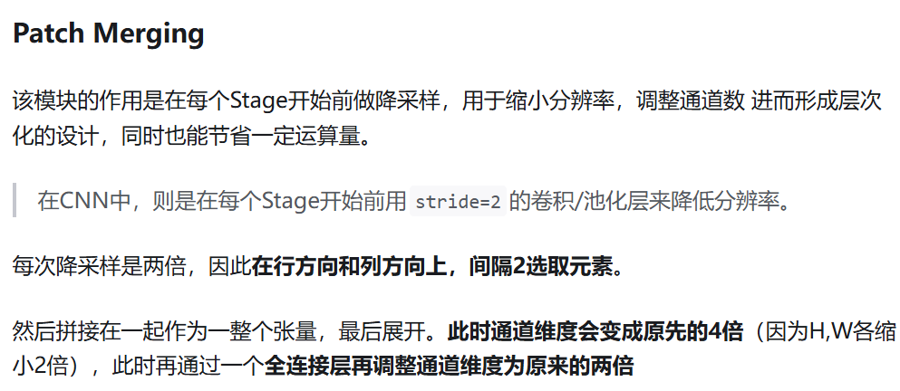 

 ## Vision Transformer

[[2010.11929] An Image is Worth 16x16 Words: Transformers for Image Recognition at Scale](https://arxiv.org/abs/2010.11929)

 

**模型架构：**

- 将输入图片分成若干个 patch (例如 16*16 ) , 然后将每个 patch **经过线性层投影**为固定长度的向量作为一个 token。
- 进行图片分类任务时，在输入序列中加入一个特殊的 token [class]，该 token 的输出则为最后的预测结果。

 

**变体：**

- ViT-H（High resolution）：ViT-H是Vision Transformer模型中的高分辨率变体。它通常适用于处理高分辨率图像或更具挑战性的视觉任务。由于处理高分辨率图像可能需要更多的计算资源和内存，因此ViT-H模型可能更庞大和复杂。
- ViT-L（Low resolution）：ViT-L是Vision Transformer模型中的低分辨率变体。它通常用于处理低分辨率图像或资源受限的环境。ViT-L模型可能比ViT-H模型更小、更轻量级，适合在资源受限的设备或场景中部署。
- ViT-B（Base resolution）：ViT-B是Vision Transformer模型中的基准分辨率变体。它可以被视为ViT模型的中间规模。ViT-B通常是指在资源充足但不需要处理过高或过低分辨率图像时使用的模型。

## 位置编码

### RoPE

https://arxiv.org/abs/2104.09864


 

``` python
def precompute_freqs_cis(dim: int, seq_len: int, theta: float = 10000.0):
    # 计算词向量元素两两分组之后，每组元素对应的旋转角度
    freqs = 1.0 / (theta ** (torch.arange(0, dim, 2)[: (dim // 2)].float() / dim))
    # 生成 token 序列索引 t = [0, 1,..., seq_len-1]
    t = torch.arange(seq_len, device=freqs.device)
    # freqs.shape = [seq_len, dim // 2] 
    freqs = torch.outer(t, freqs).float()
    # torch.polar 的文档
    # https://pytorch.org/docs/stable/generated/torch.polar.html
    # 计算结果是个复数向量
    # 假设 freqs = [x, y]
    # 则 freqs_cis = [cos(x) + sin(x)i, cos(y) + sin(y)i]
    freqs_cis = torch.polar(torch.ones_like(freqs), freqs)
    return freqs_cis

def apply_rotary_emb(
    xq: torch.Tensor,
    xk: torch.Tensor,
    freqs_cis: torch.Tensor,
) -> Tuple[torch.Tensor, torch.Tensor]:
    # xq.shape = [batch_size, seq_len, dim]
    # xq_.shape = [batch_size, seq_len, dim // 2, 2]
    xq_ = xq.float().reshape(*xq.shape[:-1], -1, 2)
    xk_ = xk.float().reshape(*xk.shape[:-1], -1, 2)
    
    # 转为复数域
    xq_ = torch.view_as_complex(xq_)
    xk_ = torch.view_as_complex(xk_)
    
    # 应用旋转操作，然后将结果转回实数域
    # xq_out.shape = [batch_size, seq_len, dim]
    xq_out = torch.view_as_real(xq_ * freqs_cis).flatten(2)
    xk_out = torch.view_as_real(xk_ * freqs_cis).flatten(2)
    return xq_out.type_as(xq), xk_out.type_as(xk)

class Attention(nn.Module):
    def __init__(self, args: ModelArgs):
        super().__init__()

        self.wq = Linear(...)
        self.wk = Linear(...)
        self.wv = Linear(...)
        
        self.freqs_cis = precompute_freqs_cis(dim, max_seq_len * 2)

    def forward(self, x: torch.Tensor):
        bsz, seqlen, _ = x.shape
        xq, xk, xv = self.wq(x), self.wk(x), self.wv(x)

        xq = xq.view(batch_size, seq_len, dim)
        xk = xk.view(batch_size, seq_len, dim)
        xv = xv.view(batch_size, seq_len, dim)

        # attention 操作之前，应用旋转位置编码
        xq, xk = apply_rotary_emb(xq, xk, freqs_cis=freqs_cis)
        
        # scores.shape = (bs, seqlen, seqlen)
        scores = torch.matmul(xq, xk.transpose(1, 2)) / math.sqrt(dim)
        scores = F.softmax(scores.float(), dim=-1)
        output = torch.matmul(scores, xv)  # (batch_size, seq_len, dim)
  # ......
```

# 强化学习

## 基础概念

强化学习（**Reinforcement learning，RL**）讨论的问题是一个**智能体(agent)** 怎么在一个复杂不确定的 **环境(environment)** 里面去极大化它能获得的奖励。通过感知所处环境的 **状态(state)** 对 **动作(action)** 的 **反应(reward)**， 来指导更好的动作，从而获得最大的 **收益(return)**，这被称为在交互中学习，这样的学习方法就被称作强化学习。

 

 **特征：** 

- **试错学习**：强化学习一般没有直接的指导信息，Agent 要以不断与 Environment 进行交互，通过试错的方式来获得最佳策略(Policy)。
- **延迟回报**：强化学习的指导信息很少，得到的奖励是延迟的，往往在事后（最后一个状态）才给出。
- 训练过程中得到的数据是有时间关联的数据（**sequential data**），而不是独立同分布的数据。
- 智能体的动作会影响随后得到的数据。在训练智能体的过程中，很多时候我们通过正在学习的智能体与环境交互来得到数据的。所以如果在训练过程中，智能体不能保持稳定，就会使我们采集到的数据非常糟糕。

**基本元素：**

 

- **环境(Environment)** 是一个外部系统，智能体处于这个系统中，能够感知到这个系统并且能够基于感知到的状态做出一定的行动。
- **智能体(Agent)** 是一个嵌入到环境中的系统，能够通过采取行动来改变环境的状态。
- **状态(State)/观察值(Observation)**：状态是对世界的完整描述，不会隐藏世界的信息。观测是对状态的部分描述，可能会遗漏一些信息。
- **动作(Action)**：不同的环境允许不同种类的动作，在给定的环境中，有效动作的集合经常被称为动作空间(action space)，包括离散动作空间(discrete action spaces)和连续动作空间(continuous action spaces)，例如，走迷宫机器人如果只有东南西北这 4 种移动方式，则其为离散动作空间;如果机器人向 360◦ 中的任意角度都可以移动，则为连续动作空间。
- **奖励(Reward)**：是由环境给的一个标量的反馈信号(scalar feedback signal)，这个信号显示了智能体在某一步采取了某个策略的表现如何。

**相关定义：**

- **回报(Return)**

  - 又称累计未来奖励**(cumulated future reward)**，一般表示为 $G$。

    $G_t=\sum\limits_{k=0}^{\infty}R_{t+k}=R_t+R_{t+1}+R_{t+2}+...$

  - 由于未来的奖励不如即时的等值奖励，所以 $R_{t+1}$ 的权重应该小于 $R_t$，通常使用**累积折扣奖励（Discounted Cumulative Reward）**

    引入折扣因子 $\gamma \in [0,1]$，有 $G_t=\sum\limits_{k=0}^{\infty}\gamma^kR_{t+k}=R_t+\gamma R_{t+1}+\gamma^2 R_{t+2}+...$ 

- **状态价值函数(State-value Function)**

  - 用来度量给定策略 $\pi$ 的情况下，当前状态 $s_t$ 的好坏程度，表示基于 $t$ 时刻的状态 $s$ 能获得的未来回报（return）的期望。

    $v_{\pi}(s)=\mathbb{E}_{\pi}[G_t|S_t=s]$

- **动作价值函数(Action-value Function)**

  - 用来度量给定状态 $s_t$ 和策略 $\pi$ 的情况下，采用动作 $a_t$ 的好坏程度，表示基于 $t$ 时刻的状态 $s$，选择动作 $a$ 后能获得的未来回报（return）的期望。

    $q_{\pi}(s,a)=\mathbb{E}_{\pi}[G_t|S_t=t,A_t=a]$

- **轨迹(Trajectory)**

  - 轨迹就是当前帧和它采取的一系列策略，即状态和动作的序列

    $\tau=(s_0,a_0,s_1,a_1,...)$
    
    给定演员的参数 $\theta$，轨迹 $\tau$ 出现的概率为
    
    $p_{\theta}(\tau)=p(s_1)p_\theta(a_1|s_1)p(s_2|s_1,a_1)p_\theta(a_2|s_2)p(s_3|s_2,a_2)...=p(s_1)\prod\limits_{t=1}^{T}p_\theta(a_t|s_t)p(s_{t+1}|s_t,a_t)$
    
    一个轨迹的奖励 $R(\tau)$ 为每一步动作获得的奖励之和
    
    $R(\tau)=\sum\limits_{t=1}^{T}r_t$

**算法分类：**

**按照环境是否已知划分：免模型学习（Model-Free） vs 有模型学习（Model-Based）**

- **Model-free**：不去学习和理解环境，环境给出什么信息就是什么信息，常见的方法有 policy optimization 和 Q-learning。
- **Model-Based**：学习和理解环境，学会用一个模型来模拟环境，通过模拟的环境来得到反馈。Model-Based 相当于比Model-Free多了模拟环境这个环节，通过模拟环境预判接下来会发生的所有情况，然后选择最佳的情况。

> 一般情况下，环境都是不可知的，所以这里主要研究无模型问题。

**按照学习方式划分：在线策略（On-Policy） vs 离线策略（Off-Policy）**

- **On-Policy**：agent 必须本人在场， 并且一定是本人边玩边学习。典型的算法为 Sarsa。
- **Off-Policy**：agent 可以选择自己玩， 也可以选择看着别人玩， 通过看别人玩来学习别人的行为准则， 离线学习同样是从过往的经验中学习， 但是这些过往的经历没必要是自己的经历， 任何人的经历都能被学习，也没有必要是边玩边学习，玩和学习的时间可以不同步。典型的方法是Q-learning，以及Deep-Q-Network。

**按照学习目标划分：基于策略（Policy-Based）和基于价值（Value-Based）。**

- **Policy-Based**：直接输出下一步动作的概率，根据概率来选取动作。但不一定概率最高就会选择该动作，还是会从整体进行考虑。适用于非连续和连续的动作。常见的方法有Policy gradients。
- **Value-Based**：输出的是动作的价值，选择价值最高的动作。适用于非连续的动作。常见的方法有Q-learning、Deep Q Network和Sarsa。
- **Actor-Critic**：二者的结合，Actor根据概率做出动作，Critic根据动作给出价值，从而加速学习过程，常见的有A2C，A3C，DDPG等。

 

## 马尔可夫决策

**马尔可夫性质（Markov property）：**

- 一个随机过程在给定现在状态盒所有过去状态情况下，其未来状态的条件概率分布仅依赖于当前状态。
- 给定当前状态时，未来状态和过去状态是条件独立的。
- 假设随机变量 $X_0,X_1...X_T$ 构成一个随机过程。如果该过程满足 $p(X_{t+1}=x_{t+1}|X_{0:t}=x_{0:t})=p(X_{t+1}=x_{t+1}|X_t=x_t)$，则具有马尔可夫性质。
- 离散时间的马尔可夫过程也称为**马尔可夫链**，马尔可夫链的状态是有限的，可以用状态转移矩阵 $P$ 来表示状态转移，$(i,j)$ 的数表示 $p(s_{t+1}=s_j|s_t=s_i)$。

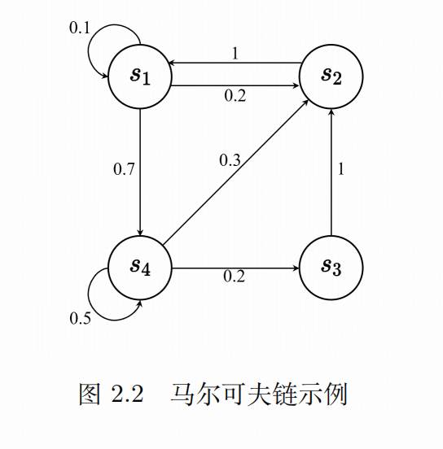 

**马尔可夫奖励过程（Markov reward process，MRP）：**

- 在马尔可夫链的基础上，加入了奖励函数 $R$，表示到达某个状态时可以获得多大的奖励。

- 如果状态数是有限的，$R$ 可以表示成一个向量。

- 计算奖励函数：

  - **蒙特卡洛采样（Monte Carlo，MC）**

    对于状态 $s_i$，从 $s_i$ 开始采样大量轨迹，取这些轨迹的平均**累计折扣奖励**作为到达 $s_i$ 的奖励。

    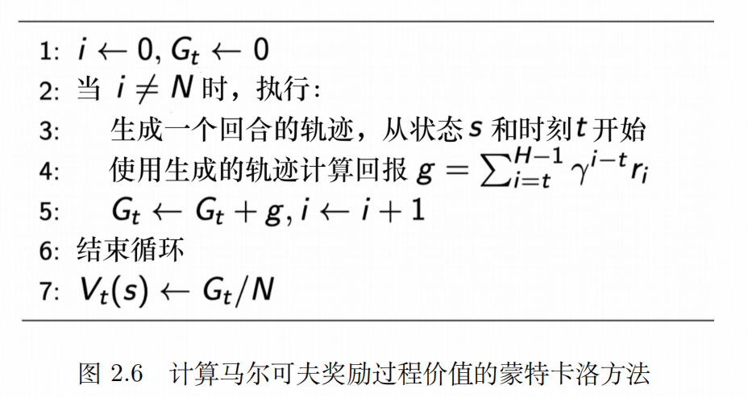 

  - **动态规划（BootStrapping，自举）**

    通过贝尔曼方程不断迭代，当更新前后的区别不大时停止。

    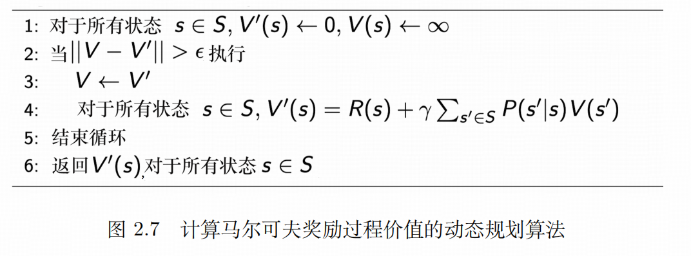 

**贝尔曼方程（Bellman Equation）：**

$V(s)=R(s)+\gamma\sum\limits_{s'\in S}p(s'|s)V(s')$

- $R(s)$ 表示进入状态 $s$ 的即时奖励。
- $\gamma\sum\limits_{s'\in S}p(s'|s)V(s')$ 表示未来奖励的折扣总和，$\gamma$ 是折扣因子。
- 矩阵形式：

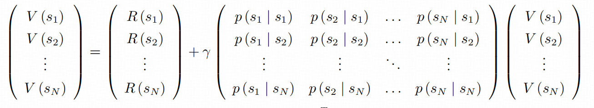 

**马尔可夫决策过程：**

- 在 MRP 的基础上，加入了智能体的决策，未来的状态取决于当前的状态和智能体采取的决策，满足 $p(s_{t+1}|s_t,a_t)=p(s_{t+1}|s_{0:t},a_t)$
- 

## 常用算法

### Q-Learning

-  基于表格，没有神经网络参与，当状态和动作空间是离散且维数不高时使用。
- 维护一张 **Q 值表**，表的维数为：状态数S * 动作数A，每个数代表在状态 S 下采用动作 A 可以获得的未来收益的折现和。通过不断迭代 Q 值表使其最终收敛，然后根据 Q 值表在每个状态下选取一个最优策略。

**步骤：**

1. 初始化一张全 0 的 Q 值表。

2. 通过 Epsilon-Greedy 策略选择一个动作并执行。

   - 将策略的选择方式分为两种：**探索(Exploration)**和利用**(Exploitation)**，探索即随机选择一个动作，利用即选择 Q 值表中值最大的动作。
   - 以 $\epsilon$ 的概率进行探索，以 $1-\epsilon$ 的概率进行利用。$\epsilon$ 一般初始为 1，随训练时间而减小。

3. 通过得到的奖励 $R(s,a)$ 来更新 Q 值表：

   $新估计值 \leftarrow 旧估计值+学习率 \times [目标-旧估计值]$

   $Q(s,a) \leftarrow Q(s,a)+\alpha(R(s,a)+\gamma \max\limits_{a'}{R(s',a')}-Q(s,a))$

### 策略梯度

**前置知识：**

- 给定一组策略参数 $\theta$, 得到的**期望奖励**为

  $\overline{R_\theta}=\sum\limits_{\tau}R(\tau)p_\theta(\tau)=\mathbb{E}_{\tau \sim p_\theta(\tau)}[R(\tau)]$

- 我们要最大化策略的期望奖励，所以使用**梯度上升（gradient ascent）**方法，计算 $\overline{R_\theta}$ 的梯度为：
  $$
  \begin{align*}
  \nabla \overline{R_\theta} &= \sum_\tau{R(\tau)\nabla p_\theta(\tau)}\\
  &=\sum_\tau{R(\tau)p_\theta(\tau)\frac{\nabla p_\theta(\tau)}{p_\theta(\tau)}}\\
  &=\sum_\tau{R(\tau)p_\theta(\tau)\nabla \log p_\theta(\tau)}\\
  &=\mathbb{E}_{r\sim p_\theta(\tau)}[R(\tau)\nabla \log p_\theta(\tau)]
  \end{align*}
  $$
  

### DQN

### PPO

**proxomal policy optimization，近端策略优化**

### DPO

**Direct Preference Optimization，直接偏好优化**

### RLHF

**Reinforcement Learning from Human Feedback，人类反馈强化学习**

 

 

# 计算机视觉(CV)

## 特征处理

### 梯度直方图

**Histogram of oriental gradient(HOG)**

### DPM

**Deformable part model(DPM)**：可变形的组件模型

## 超分辨率Super-Resolution

 

### 插值

 

 

 

 

 

 

  

 

  

 

 

## 图像分割

### 语义分割

### 实例分割

### SAM

[[2304.02643] Segment Anything](https://arxiv.org/abs/2304.02643)

 

 

### SEEM 

[[2304.06718] Segment Everything Everywhere All at Once](https://arxiv.org/abs/2304.06718)

 

 

  

## 目标检测

### yolo

### SSD

### faster RCNN

### DINO

[[2203.03605] DINO: DETR with Improved DeNoising Anchor Boxes for End-to-End Object Detection](https://arxiv.org/abs/2203.03605)


 

 

# 自然语言处理(NLP)

## TF-IDF

 

 

  

 

  

TF−IWF 这种加权方法 **降低了文档集/语料库中同类文本对词权重的影响，更加精确地表达了词在待查文档中的重要程度**。

传统 TF−IDF 所求的权值一般很小，甚至接近于 0，精确度也不高，而 TF−IWF 的计算结果恰能解决权值过小的问题。

## LDA 主题模型

**Latent Dirichlet Allocation(LDA)**

- 潜在狄利克雷分配模型，是一种**文档生成模型**，也是**无监督学习**模型（需要手动输入主题数量）。

- LDA 模型认为：每个文档是由多个主题混合而成的，而每个主题是由多个词语混合而成的。

  混合的意思是：每个主题/词语都按照一定的概率分布出现。

- LDA 模型把文档的构造看作一个概率过程：首先以一定的概率选择某个主题，然后在这个主题下以一定的概率选择某个词语。不断重复这个过程从而生成整篇文章。

- LDA 模型是一种词袋模型，假设词与词之间不存在顺序关系。优点：简化算法。 

 

## n-gram

- 它的基本思想是将文本里面的内容按照字节进行大小为N的滑动窗口操作，形成了长度是N的字节片段序列。

  每一个字节片段称为gram，对所有gram的出现频度进行统计，并且按照事先设定好的阈值进行过滤，形成关键gram列表，也就是这个文本的向量特征空间，列表中的每一种gram就是一个特征向量维度。

- 该模型基于这样一种假设，第N个词的出现只与前面N-1个词相关，而与其它任何词都不相关，整句的概率就是各个词出现概率的乘积。这些概率可以通过直接从语料中统计N个词同时出现的次数得到。常用的是二元的 Bi-Gram 和三元的 Tri-Gram。

## Tokenizer

  

 

 

 

 

  

 

### BPE

 

  

 

 

### WordPiece

 

### Unigram

 

 

 

# 分布式训练

- **Model Parallelism，模型并行，MP**

  模型并行主要应用于模型相比显存来说更大，一块 GPU 无法加载整个模型，通过把模型切割成几个部分，分别加载到不同的 GPU 上训练。

- **Data Parallelism，数据并行，DP**

  每个 GPU 复制一份模型，将一批样本分成多份分发到各个 GPU 模型并行计算。因为求导以及加和都是线性的，数据并行在数学上也有效。相当于加大了 batch_suze，得到更准确的梯度并加速训练。

- **Pipeline Parallelism，流水线并行，PP**
- **Tensor Parallelism，张量并行，TP**

## 分布式基础

### Map Reduce

[mapreduce-osdi04.pdf](https://static.googleusercontent.com/media/research.google.com/zh-CN//archive/mapreduce-osdi04.pdf)

**六大执行过程：**

- **Input、Split、Map、Shuffle、Reduce、Finalize**
- Split 表示数据的分发，把全部数据拆分成若干份，每个 Map Worker 分配一份。
- Map 对输入的 <key, value> 数据进行处理，以 <key, list(value)> 的形式写到本地。
- Shuffle 将 Map worker 的输出进行分区、分组、排序、和合并等处理，作为输入传给 Reduce worker
- Reduce 对数据进行整合，把 <key, list(value)> 形式的数据整理成 <key,value> 形式。

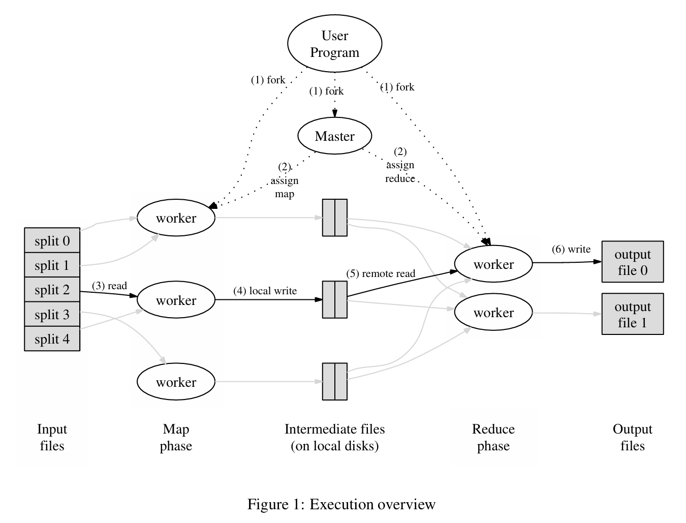 

### 通信原语

[Operations — NCCL 2.6.4 documentation](https://docs.nvidia.com/deeplearning/nccl/user-guide/docs/usage/operations.html)

#### Broadcast

- 广播：将主 GPU 的数据发送到其他所有 GPU，最后**每个 GPU 有一份主 GPU 的数据**。
- **模型分发：**将模型参数从主 GPU 分发给全部 GPU 。
- **配置分发：**把全局变量或配置文件从主 GPU 分发给全部 GPU。 

```python
torch.distributed.broadcast(tensor, src=0)
```

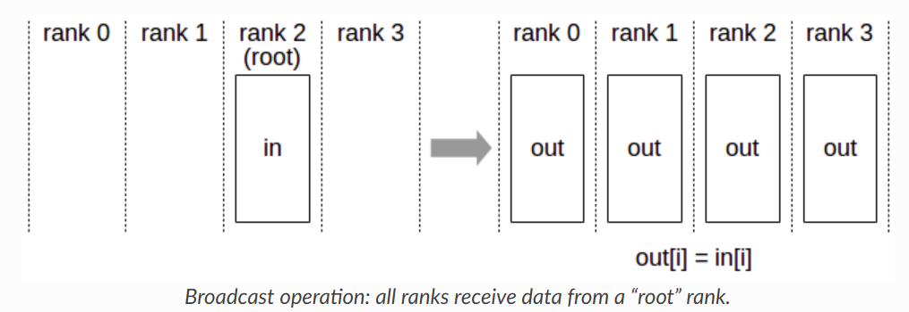 

#### Scatter

- 散射/分散：把主 GPU 的数据分成同等大小的数据块，分发给其他 GPU，最后**每个 GPU 有一个数据块**。
- **输入数据分发：**把模型的输入切分成许多 mini-batch，分发给各个 GPU 进行训练。

#### Gather

- 聚集：把所有 GPU 的数据拼接到一起，发送给主 GPU，最后**主 GPU 有一份拼接后的数据**。
- 将来自所有节点的数据，沿着指定的维度进行拼接（Concatenate），然后将拼接后的完整数据存储在一个指定的目标节点上。
- **模型并行中的结果汇聚**：如果模型的不同部分（比如不同的层或者注意力头）在不同GPU上计算，最后需要将各个部分的输出结果 Gather 到 主 GPU 上进行后续处理或得到最终输出。
- **分布式评估/推理**：将各个 GPU 上对部分数据的预测结果收集起来，得到完整的预测结果。 

#### All Gather

- 全聚集：把所有 GPU 的数据拼接到一起，发送给每个 GPU，最后**每个 GPU 有一份拼接后的数据**。
- All Gather = Gather + Broadcast
- **需要全局信息的计算**：比如某些复杂的归一化层或者需要全局上下文的操作，可能需要每个GPU都拥有其他所有GPU上的某部分数据（如激活值或部分权重）。
- **ZeRO-1优化**：在ZeRO-1优化中，优化器状态是分片的，但在参数更新时，每个GPU需要获取完整的优化器状态来更新它负责的那部分参数，这时会用到 All Gather。

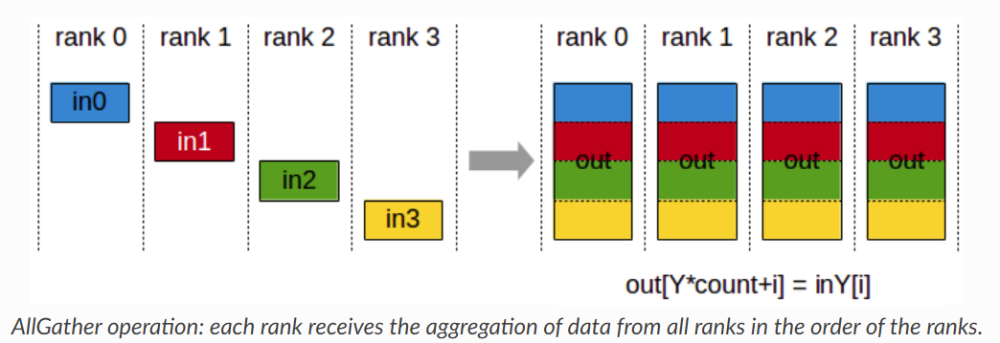 

#### Reduce

- 规约：对所有 GPU 的数据执行规约操作（求和/求平均/求最大值），发送给主 GPU，最后**主 GPU 有一份规约后的数据**。
- **收集损失**：计算全局的 loss 平均值，将各 GPU 的 loss 值 Reduce 到主 GPU 进行平均计算。

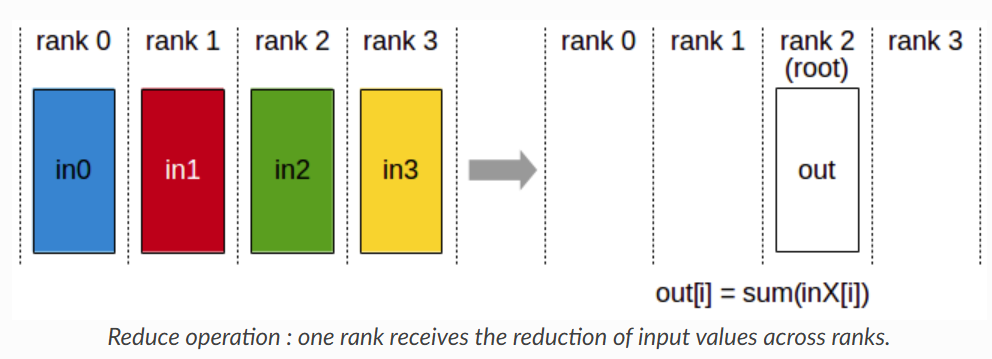 

#### All Reduce

- 全规约：对所有 GPU 的数据执行规约操作（求和/求平均/求最大值），发送给每个 GPU，最后**每个 GPU 有一份规约后的数据**。
- **数据并行的梯度同步**：通过 All Reduce(通常是 SUM)操作，求出所有 GPU 的梯度和并同步给所有 GPU，然后每个 GPU 可以独立同步地用这个梯度来更新模型参数。

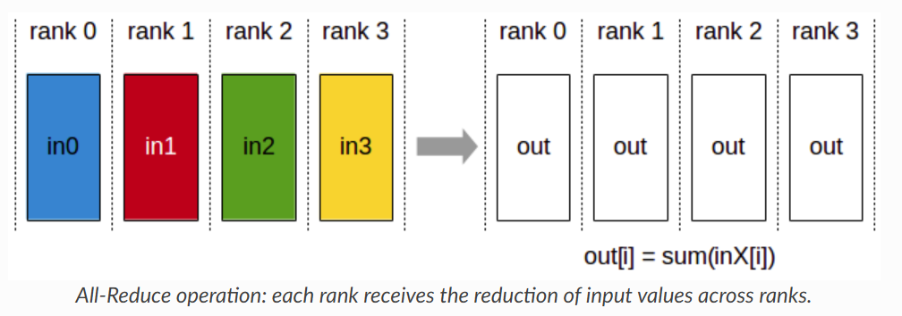  

#### Reduce Scatter

- 规约分发：对所有 GPU 执行规约操作，然后分成同等大小的数据块分发给其他 GPU，最后**每个 GPU 有一个规约后的数据块。**
- Reduce Scatter = Reduce + Scatter
- ZeRO-2/ZeRO-3 优化：在ZeRO（尤其是第2和第3阶段）优化中，梯度是分片的。在梯度计算完成后，使用Reduce-Scatter对所有节点上的梯度进行求和，并且每个节点只接收到自己负责更新的那部分参数对应的最终梯度和，极大减少了每个GPU需要存储的梯度数据量。

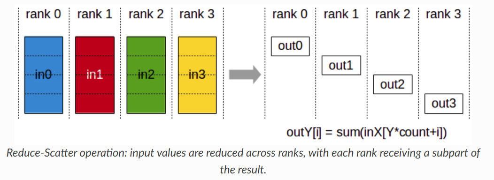 

## NCCL

**NVIDIA Collective Communications Library**

**全局变量**

| 参数             | 意义                  | 说明                                                         |
| ---------------- | --------------------- | ------------------------------------------------------------ |
| NCCL_IB_DISABLE  | 禁用 IB 网卡传输端口  | IB(InfiniBand)是一种用于高性能计算的计算机网络通信标准。     |
| NCCL_SHM_DISABLE | 禁用共享内存传输      | 共享内存(SHM)传输支持运行在相同处理单元/机器中的实体之间的快速通信，这依赖于主机操作系统提供的共享内存机制 |
| NCCL_P2P_DISABLE | 禁用 GPU 之间信息传输 | P2P使用CUDA和NVLink直接实现GPU之间的传输与访问               |

**常用命令**

```
nvidia-smi topo -p2p n				# 查看 GPU 是否支持 NVLINK
```

## 数据并行

**Data Parallelism，DP**

常用的 API：

- torch.nn.DataParallel(DP)
- torch.nn.DistributedDataParallel(DDP) 

### DP

 

```python
replicas = nn.parallel.replicate(modile, device_ids)
inputs = nn.parallel.scatter(input, device_ids)
outputs = nn.parallel,parallel_apply(replicas, inputs)
result = nn.parallel.gather(outputs, output_device)
```

**执行过程：**

1. 数据分配：对于 N 张 GPU，将第 0 张作为主 GPU，一个 batch 的数据先加载到主 GPU 上，然后被分割成 N 份，**由主 GPU 分发给另外 N-1 个 GPU 上**，此时每个 GPU 都有一份数据。
2. 模型复制：主 GPU 上有一份完整的网络模型，然后复制（replicate）到其他 GPU 上，此时将更新后的模型参数同步给其他 GPU。
3. 前向传播：每个 GPU 独立进行前向传播（线程并行），计算各自的预测输出。
4. 汇总输出：主 GPU 收集（gather）各个 GPU 的输出，在主 GPU 上计算损失。
5. 反向传播：将计算后到损失分发（scatter）到各个 GPU 上，独立进行反向传播，计算各自的梯度。
6. 汇总梯度：每个 GPU 计算完梯度后，汇总（reduce）梯度到主 GPU ，在主 GPU 上求梯度平均值。
7. 参数更新：主 GPU 使用计算得到的平均梯度更新模型参数。

**缺点：**

- DP 在单机器上使用多线程来处理并行计算，线程之间会争抢 GIL，从而引发性能瓶颈。
- DP 需要把数据 scatter 到不同 GPU，计算完毕后再 gather 计算结果，带来额外的开销。
- 每次迭代都需要给每个 GPU 复制一份模型，来保证各个 GPU 上模型参数一致，引入额外的模型复制的开销。
- gather 输出、reduce 梯度、参数更新都发生在主 GPU 上，导致主 GPU 超负荷时其他 GPU 还没有完全利用，GPU 的利用率不高。 

### DDP

**Distributed Data Parallelism**

**执行过程：**

1. 模型复制：模型被复制到每张 GPU 上，每张卡上都有完整的模型副本
2. 数据分配：通过 **DistributedSampler**，每个进程独立地加载自己那部分的数据子集。
3. 前向传播：每个 GPU 独立进行前向传播，计算各自的预测输出。
4. 反向传播：每个 GPU 独立计算损失，进行反向传播，计算梯度。
5. 梯度汇总：所有 GPU 通过 **Ring-Allreduce** 操作汇总梯度，使得每个 GPU 上梯度一致
6. 参数更新：每个 GPU 使用汇总后的梯度更新自己的模型参数，更新之后所有 GPU 上的模型参数保持一致。
7. 重复 2-6 操作直到模型收敛

**和 DP 相比的优势：**

- DDP 使用多进程处理，每个 GPU 都有自己的专用进程，避免了 Python 解释器 GIL 带来的性能开销。
- 每个进程独立更新模型参数，减小了通信开销。梯度更新使用 Ring-Allreduce，效率高。
- 具有更好的扩展性，既支持单机多卡，又支持多机多卡。

**步骤：**

1. 设置环境变量

   - MASTER_ADDR：主节点的 IP 地址（通常是 eth0）
   - MASTER_PORT：主节点的端口号
   - WORLD_SIZE：参加训练的进程总数（通常是 GPU 总数，即 节点数 * 每个节点的GPU数）
   - RANK：当前进程的编号——[0, world_size-1]

   在单机多卡上运行 DDP 时，pytorch 会自动处理这些环境。

2. 初始化进程组：通过 `torch.distributed.init_process_group()` 来初始化一个进程组，用于在进程间通信。

   然后使用 `torch.cuda.set_device(local_rank)` 将进程和 GPU 绑定，即指定当前进程该使用哪个 GPU。

3. 封装模型：每个进程独立初始化一个模型副本，然后封装成 `torch.nn.parallel.DistributedDataParallel`。

4. 使用 `torch.utils.data.DistributedSampler`  来确保每个 GPU 处理的数据是不同的子集。

5. 调用 `torch.distributed.destroy_process_group()` 销毁进程组

**会遇到的坑：**

- 在DDP中，所有模型参数都必须参与前向传播并最终影响损失函数，否则会出现梯度同步问题。
- `find_unused_parameters=True` 会带来极大的性能开销，可能直接导致训练卡死

```python
import os
import torch
import torch.distributed as dist
import torch.multiprocessing as mp
from torch.nn.parallel import DistributedDataParallel as DDP
from torch.utils.data import DataLoader, DistributedSampler
from torchvision import datasets, transforms

# 定义模型（示例用简单的线性模型）
class MyModel(torch.nn.Module):
    def __init__(self):
        super(MyModel, self).__init__()
        self.fc = torch.nn.Linear(10, 10)
    def forward(self, x):
        return self.fc(x)

# 训练函数
def train(rank, world_size):
    # 初始化进程组
    # 常见的通信后端包括 gloo 和 nccl，其中 nccl 是在 GPU 上最常用的后端
    dist.init_process_group(backend='nccl', init_method='env://', world_size=world_size, rank=rank)

    # 设置当前 GPU
    torch.cuda.set_device(rank)  # 若是在多机上，此处设置为local_rank

    # 创建模型并转移到当前 GPU
    model = MyModel().cuda(rank)  # 若是在多机上，此处设置为local_rank

    # 将模型包装为 DDP 模型
    model = DDP(model, device_ids=[rank])	# 若是在多机上，此处设置为local_rank

    # 定义损失函数和优化器
    criterion = torch.nn.CrossEntropyLoss().cuda(rank)	# 若是在多机上，此处设置为local_rank
    optimizer = torch.optim.SGD(model.parameters(), lr=0.01)

    # 加载数据集（示例使用 CIFAR10）
    transform = transforms.Compose([transforms.ToTensor(), transforms.Normalize((0.5,), (0.5,))])
    train_dataset = datasets.CIFAR10(root='./data', train=True, download=True, transform=transform)

    # 使用 DistributedSampler 确保每个 GPU 得到不同的数据
    train_sampler = DistributedSampler(train_dataset, num_replicas=world_size, rank=rank)	# 若是在多机上，此处设置为local_rank
    train_loader = DataLoader(dataset=train_dataset, batch_size=32, sampler=train_sampler)

    # 开始训练
    for epoch in range(10):
        model.train()
        train_sampler.set_epoch(epoch)  # 每个 epoch 设置随机种子以保证不同进程之间的数据一致
        for batch_idx, (data, target) in enumerate(train_loader):
            data, target = data.cuda(rank), target.cuda(rank)	# 若是在多机上，此处设置为local_rank
            optimizer.zero_grad()
            output = model(data)
            loss = criterion(output, target)
            loss.backward()
            optimizer.step()

    # 销毁进程组
    dist.destroy_process_group()

if __name__ == "__main__":
    world_size = 2  # 使用 2 张 GPU
    # 使用 multiprocessing 启动多进程，每个 GPU 对应一个进程
    mp.spawn(train, args=(world_size,), nprocs=world_size, join=True)
```

 

 

## 流水线并行

**Pipeline Parallelism**

### GPipe

https://arxiv.org/pdf/1811.06965


## 张量并行

- 核心思想：将矩阵计算分块到多张 GPU 上计算

```python
# 张量并行
class linear_identity_allreduce(torch.autograd.Function):
    @staticmethod
    def forward(ctx, input, weight):
	# forward的时候，不用进行通信操作
        ctx.save_for_backward(input, weight)
        output = torch.matmul(input, weight.t())
        return output
    
    @staticmethod
    def backward(ctx, grad_output):
	# backward时候，进行all reduce操作
        input, weight = ctx.saved_tensors
        tp_group = get_tensor_parallel_group()
        grad_input = torch.matmul(grad_output, weight)
        torch.distributed.all_reduce(grad_input, group=tp_group, async_op=True)
        
        grad_output = grad_output.contiguous()
        grad_output = grad_output.view(grad_output.shape[0] * grad_output.shape[1],
                                       grad_output.shape[2])
        input = input.view(input.shape[0] * input.shape[1], input.shape[2])
        grad_weight = torch.matmul(grad_output.t(), input)
        return grad_input, grad_weight


class ColumnParallelLinear(nn.Module):
    """linear layer with column parallelism
    
    The linear layer is defined as Y = XA + b. A is parallelized along
    its second dimension as A = [A_1, ..., A_p].
    """
    
    def __init__(
        self, 
        input_size: int, 
        output_size: int,
    ) -> None:
        super().__init__()
        self.input_size = input_size
        self.output_size = output_size
        
        tp_group = get_tensor_parallel_group()
        tp_size = tp_group.size()

        assert output_size % tp_size == 0, \\
            "output_size must be divisible by tensor parallel size"
        self.output_size_partition = output_size // tp_size
        
        self.weights = torch.nn.Parameter(torch.empty(
            self.output_size_partition, self.input_size))
        nn.init.xavier_uniform_(self.weights)
        
    def forward(self, input_: torch.Tensor):
        args = [input_, self.weights]
        out = linear_identity_allreduce.apply(*args)
        return out
```


## DeepSpeed

# 推荐系统

 

 

 

## 召回

 

# 模型轻量化

## 蒸馏

 

 

 

 

 

 

## 量化

 

 

 

 

 

###  训练后量化(PTQ)

**Post-training-quantization**

 

 

### 量化感知训练(QAT)

**Quantization-aware-training**

 

## 低秩分解

# 大语言模型

## 微调

### 低秩适应(LoRA)

**Low-Rank Adaptation**

 

 

 

### 监督微调（SFT）

**Supervised Fine-Tuning**


## Tool Learning

- 工具学习的目的是让大模型面对用户复杂任务时，能够**动态地使用外部工具来完成任务**，从而显著提升模型的整体能力和应用广度。

**四个阶段：**

- Task Planning，任务规划
- Tool Selection，工具选择
- Tool Calling，工具调用
- Response Generation，回答生成

**两种范式(Paradigm)：**

- **一步式（One-step）**：模型一次性规划出所有子任务并调用工具后，直接产出最终答案。
- **迭代式（Iterative）**：在执行过程中模型多次微调任务或者多次调用工具，每一步都可以更加工具返回的信息做出修正，最后完成整体任务。

 

### Task Planning

 

### Tool Selection

 

### Tool Calling

 

###  Response Generation

 

### MCP

**Model Context Protocol，模型上下文协议**

## 多模态

  

### 对比学习

- 是一种特殊的无监督学习方法（自监督学习），通过最大化相关样本之间的相似性并最小化不相关样本之间的相似性来学习数据表示。通常使用一种高自由度、自定义的规则生成正负样本。在模型预训练中有广泛的应用。 

 

 

 

   

 

 

#### CLIP

**Contrastive Language-Image Pretraining**

[[2103.00020] Learning Transferable Visual Models From Natural Language Supervision](https://arxiv.org/abs/2103.00020)

- 是视觉-语言对齐的经典模型，使用图像文本双编码器，通过大规模的图文对进行对比学习。
- 对比学习：学习一个共享嵌入空间，使得正确的图文对特征距离最小化，错误的图文对特征距离最大化。
- 大型预训练：在大规模的多模态数据上进行预训练，学会基础的跨模态知识，然后通过微调来实现特定任务。
- 优点：架构简洁，效果好。在 **zero-shot 文本-图像检索，zero-shot 图像分类，open-domain 检测分割**等任务上效果非常好。

- 动机：将 NLP 中大型预训练的框架+对比学习迁移在多模态对齐上。

**训练目标：**

- 预测图像与文本配对，通过最大化图像与文本嵌入的余弦相似度（正样本）并最小化错误配对的相似度（负样本），优化对称交叉熵损失（InfoNCE 损失）。给定一批 N 个图像文本对，CLIP 学习预测 N×N 个可能配对中实际发生的配对，计算图像和文本嵌入的成对余弦相似度（经温度参数缩放），然后通过对称交叉熵损失优化。

 

 

**预训练**

- 模型的输入是若干个 图像-文本 对，假设每个 batch 有 N 个图像文本对。
- 图像：通过一个 Image Encoder 得到图像特征，encoder 是 ResNet 或者 **Vision Transformer**，得到 N 个图像特征 $(I_1,I_2...I_N)$
- 文本：通过一个 Text Encoder 得到文本特征，encoder 是 **Bert**，得到 $(T_1,T_2...T_N)$
- 构建正负样本进行对比学习。配对的图像文本对作为正样本（即对角线部分 $I_1-T_1,I_2-T_2...I_N-T_N$)，剩余图像文本对为负样本。
- 数据集：**WIT (WebImage Text)**，由 OpenAI 专门收集，有4亿个图像文本对，且质量高，数据清理较好。

**推理**


 

#### CLAP

 

#### BLIP

https://arxiv.org/abs/2201.12086

 

**模型架构：**

- **image encoder**: 图像编码器，用于提取视觉特征，初始化为在ImageNet上预训练的ViT，该模型需要与其他3个模型联合训练，没有单独的训练目标。
- **text encoder**: 文本编码器，用于提取文本特征，初始化为Bert。该模型与image encoder联合训练的目标为 ITC（Image-Text Contrastive Loss），ITC 将图像和文本映射到相同的特征空间（与CLIP类似）。
- **image-grounded text encoder：**图像文本编码器，用于判断文本和图像是否匹配。该模型的输入为[Encode] +文本，另外每个block层都以交叉注意力的形式关注**image encoder**对应层的视觉特征。训练目标为ITM(Image-Text Matching Loss)，即对当前文本和图像是否匹配进行二分类。
- **image-grounded text decoder：**图像文本解码器，用于生成图像的caption。交叉注意力机制的引入与image-grounded text encoder类似，训练目标为 LM 损失(Language Modeling Loss)。

**优化目标：**

- **图像文本对比损失（ITC）**：通过引入动量编码器，鼓励正图像文本对在特征空间中具有相似表示，与负对形成对比，**从而对齐视觉和语言的特征空间**。具体计算时，将图像文本对的输出特征通过特定方式计算相似度，优化对比损失以最大化正样本相似度并最小化负样本相似度。
- **图像文本匹配损失（ITM）**：将其作为二分类任务，利用图像接地文本编码器学习图像文本的多模态表示，通过 ITM 头（线性层）预测图像文本对是否匹配，采用硬负样本挖掘策略选择更有信息量的负样本进行损失计算。
- **语言建模损失（LM）**：基于图像接地文本解码器，以自回归方式生成文本描述，优化交叉熵损失，在计算时应用标签平滑（0.1）以提高模型的泛化能力。

#### BLIP2

https://arxiv.org/abs/2301.12597

  

 

### DINO

[[2104.14294] Emerging Properties in Self-Supervised Vision Transformers](https://arxiv.org/abs/2104.14294)

 

### VLM

## MoE 架构

[A Visual Guide to Mixture of Experts (MoE)](https://newsletter.maartengrootendorst.com/p/a-visual-guide-to-mixture-of-experts)

    

**核心思想：**

- 把传统 Transformer 模型里每个前馈网络 (FFN) 层替换成一个 MOE 层，每个 MOE 层由专家网络和门控网络组成。 

  每个专家在训练过程中学习不同的信息，而在推理时仅使用和当前任务最相关的特定专家。

- **专家网络(Experts)：**

  每个专家是一个独立的子网络（通常是 FFN），在实际计算中只有部分专家会被激活并参与处理。通过让多个专家分担不同数据子集的计算，模型在预训练时可以以较低的计算开销获得大参数量带来的表示能力。

- **门控网络(Gating/Router)：**

  负责根据输入 token 的特征动态选择激活哪些专家。门控网络一般采用一个带 softmax 的简单前馈网络来计算每个专家的权重。经过训练后，门控网络会逐步学会将相似的输入路由到表现更好的专家。 

 

**选择最适合该任务的专家：**

 

路由器（或门控网络）本身也是一个 FFN，它根据特定的输入选择专家。路由器会输出概率值，并利用这些概率来选择最匹配的专家：

**专家层返回被选定专家的输出，并乘以门控值（选择概率）。**

路由器和专家（其中仅选择少部分）共同构成了 MoE 层。

给定的 MoE 层有两种类型：稀疏专家混合模型（Sparse Mixture of Experts）和密集专家混合模型（Dense Mixture of Experts）。

两者都使用路由器来选择专家，但稀疏 MoE 只选择少数几个专家，而密集 MoE 则选择全部专家，但可能会以不同的分布进行选择。

 

### 负载均衡

 

然而，这个简单的功能往往会导致路由器总是选择相同的专家，因为某些专家可能比其他专家学习得更快。

这不仅会导致专家选择的不均匀分布，还会导致某些专家几乎没有被训练过。这会在训练和推理过程中引发问题。

因此，我们希望在训练和推理期间，各个专家的使用具有同等的重要性，这就是所谓的负载平衡。某种程度上，这是为了防止模型在同一组专家上过拟合。

#### KeepTopK

一种对路由器进行负载平衡的方法是使用一个简单的扩展策略，称为 KeepTopK。通过引入可训练的（高斯）噪声，我们可以防止总是选择相同的专家：

 

然后，除希望激活的前 k 个专家（例如 2 个）以外的所有专家权重都将被设为 $-\infty$。

将这些权重设为 $-\infty$ 时，SoftMax 操作后的输出概率将变为 0。

 


#### 辅助损失

#### 专家容量

### Switch Transformer

### GShard

### Vision-MoE

### 优势

- **提高模型性能**：通过将多个专家的预测结果进行整合，MoE 模型可以在不同的数据子集或任务方面发挥每个专家的优势，从而提高整体模型的性能。例如，在图像分类任务中，一个专家可能擅长识别动物图片，而另一个专家可能擅长识别车辆图片，通过门控网络的合理分配，MoE 模型可以更准确地对不同类型的图片进行分类。
- **减少计算成本**：与传统的密集模型相比，MoE 模型在处理每个输入样本时，只有相关的专家会被激活，而不是整个模型的所有参数都被使用。这意味着 MoE 模型可以在保持较高性能的同时，显著减少计算资源的消耗，特别是在模型规模较大时，这种优势更为明显。例如，对于一个具有数十亿参数的大型语言模型，采用 MoE 架构可以在不增加太多计算成本的情况下，通过增加专家的数量来进一步提升模型的性能。
- **增强模型的可扩展性**：MoE 模型的架构设计使得它可以很容易地扩展到更多的专家和更大的模型规模。通过增加专家的数量，模型可以覆盖更广泛的数据特征和任务类型，从而在不增加计算复杂度的情况下，提升模型的表达能力和泛化能力。这种可扩展性为处理大规模、复杂的数据集提供了有效的解决方案，例如在处理多模态数据（包含文本、图像、语音等多种类型的数据）时，MoE 模型可以通过设置不同的专家来专门处理不同模态的数据，实现更高效的多模态融合。

### 挑战

- 计算成本与资源管理
  - **内存需求高**：MoE模型需要将所有专家的参数都加载到内存中，即使在推理过程中只使用其中一部分专家。例如，以Mixtral 8x7B这样的MoE模型为例，需要有足够的VRAM来容纳一个47B参数的稠密模型。这是因为MoE模型中只有FFN层被视为独立的专家，而模型的其他参数是共享的。高内存需求使得在资源有限的情况下部署和运行MoE模型变得困难，特别是在需要处理大规模参数模型时，对硬件设备的要求更为苛刻。
  - **分布式训练复杂**：为了应对大规模模型的训练，通常需要采用分布式训练的方式。但在MoE模型中，由于专家之间的数据交换和并行训练需要机间all-to-all通信来实现，这增加了通信成本。随着模型规模的增大，通信开销也相应增加，可能导致训练效率降低。例如，在一个大规模分布式训练场景中，若模型参数规模达到数十亿甚至更大，通信延迟和网络拥塞问题可能会严重影响训练速度和性能。因此，在实际部署过程中，需要仔细设计通信策略和优化网络拓扑，以降低通信延迟和潜在的网络拥塞。
  - **专家容量限制**：为了防止特定专家过载并确保工作负载平衡，通常会对每个专家可以同时处理的输入数量设置阈值。例如，采用top-2路由和1.25的容量因子，这意味着每个输入选择两个专家，每个专家处理其通常容量的1.25倍。这种策略虽然可以在一定程度上平衡负载，但也可能导致部分数据无法及时处理或需要重新分配，影响训练和推理的效率。此外，专家容量的设置需要根据具体的任务和模型规模进行调整，这增加了模型配置和管理的复杂性。
- 过拟合与泛化问题
  - **过拟合风险**：与稠密模型相比，MoE模型在微调时更易产生过拟合现象。这是因为MoE模型的参数量虽然大，但在实际应用中只激活部分专家，模型的复杂度相对较高。例如，拥有1.6T参数量的MoE预训练模型Switch Transformer，在SuperGLUE等常见基准上进行微调时，其整体性能却落后于较小的模型。这表明在微调过程中，模型可能会过度拟合训练数据中的噪声和细节，而无法很好地泛化到新的、未见过的数据上。
  - **泛化能力不足**：MoE模型的泛化能力在某些任务上表现不佳，尤其是在需要对输入数据进行深入理解和推理的任务中。例如，在重理解任务（如SuperGLUE）上，MoE模型的表现不如对应的稠密模型。这可能是因为MoE模型在训练过程中，专家之间的协作和知识共享不够充分，导致模型对特定任务的理解和处理能力有限。此外，门控网络的设计和训练也可能影响模型的泛化能力，如果门控网络不能准确地将输入数据分配给最合适的专家，就会影响模型的整体性能。
  - **微调策略选择**：为了提高MoE模型在微调阶段的泛化能力，需要选择合适的微调策略。一种可行的方法是尝试冻结所有非专家层的权重，只对MoE层的参数进行更新。实验结果显示，这种方法几乎与更新所有参数的效果相当，同时可以加速微调过程并降低显存需求。此外，使用较小的批量大小和较高的学习率进行微调，也有助于提高模型的泛化性能。然而，这些策略的选择需要根据具体的任务和模型情况进行调整，不同的任务可能需要不同的微调策略来达到最佳效果。

## RAG

**Retrieval-Augmented Generation，检索增强生成**

- 通过给大模型提供外部的知识库，根据用户提示检索出相关信息，合并到 prompt 中输入给大模型，以增强模型处理知识密集型任务的能力，例如问答、文本摘要、内容生成等。

**动机：**

- **知识的局限性**：模型的训练数据基本来自网络上的公开数据，缺少一些离线的、实时的、非公开的信息和知识。
- **幻觉**：大模型不具备某一方面的知识时或在不擅长的场景中，容易出现幻觉问题。通过提供对应领域的知识，可以减轻幻觉问题。
- **数据安全**：由于数据安全的考虑，企业不愿意把私域数据放在第三方平台训练。通过RAG提供数据库可以为大模型提供私有的数据。

**步骤：**

1. **准备知识文档**

   从多个数据源收集数据，并做好数据清理，将 csv、pdf 等文件清理成大语言模型可以理解的纯文本数据。

   如果文档过长，还需要将长篇文档分割成多个文本块，以便更高效地处理和检索信息。

2. **训练嵌入模型**

   训练 Word2Vec / BERT 等嵌入模型，将文本转换为向量表示，然后通过计算它们之间的相似度便可以确定它们的关联程度。

3. **构建向量数据库**

   向量数据库是专门设计用于存储和检索向量数据的数据库系统。在RAG系统中，通过嵌入模型生成的所有向量都会被存储在这样的数据库中，优化了处理和存储大规模向量数据的效率。

4. **查询检索**

   用户的问题会被输入到嵌入模型中进行向量化处理。然后，系统会在向量数据库中搜索与该问题向量语义上相似的知识文本或历史对话记录并返回。

5. **生成回答**

   将用户提问和检索到的信息结合，构建出一个提示模版，输入到大语言模型中生成回答。

**优化：**

- 多级索引：将庞大的数据和信息需求按类别划分，并在不同层级中组织，以实现更有效的管理和检索。
- 数据分块：把文档分割成多个文本块再进行向量嵌入，其目的是在保持语义上的连贯性的同时，尽可能减少嵌入内容中的噪声，从而更有效地找到与用户查询最相关的文档部分。如果分块太大，可能包含太多不相关的信息，从而降低了检索的准确性。相反，分块太小可能会丢失必要的上下文信息，导致生成的回应缺乏连贯性或深度。

## 开源大模型

### 千问系列

#### Qwen 2.5

对于稠密模型，团队延续了 Qwen2 的 Transformer 解码器架构，并在此基础上进行了优化。该架构包括以下关键组件：

- **分组查询注意力（Grouped Query Attention, GQA）**：用于高效地利用 KV 缓存。
- **SwiGLU 激活函数**：增强非线性激活。
- **旋转位置编码（RoPE）**：用于编码位置信息。
- **QKV 偏置**：用于提升注意力机制的表现。
- **RMSNorm**：在预归一化后使用，以保证训练过程稳定。
- **BBPE（Bytewise Byte Pair Encoding）**：用于分词。

#### Qwen 3

 

#### Qwen 2 vl

https://arxiv.org/abs/2409.12191

**主要改进：**

1. **读懂不同分辨率和不同长宽比的图片**：Qwen2-VL 在 MathVista、DocVQA、RealWorldQA、MTVQA 等视觉理解基准测试中取得了全球领先的表现。
2. **理解20分钟以上的长视频**：Qwen2-VL 可理解长视频，并将其用于基于视频的问答、对话和内容创作等应用中。
3. **能够操作手机和机器人的视觉智能体**：借助复杂推理和决策的能力，Qwen2-VL 可集成到手机、机器人等设备，根据视觉环境和文字指令进行自动操作。
4. **多语言支持**：为了服务全球用户，除英语和中文外，Qwen2-VL 现在还支持理解图像中的多语言文本，包括大多数欧洲语言、日语、韩语、阿拉伯语、越南语等。

模型架构：整体上我们仍然延续了 Qwen-VL 中 ViT 加 Qwen2 的串联结构，在三个不同尺度的模型上，我们都采用 600M 规模大小的 ViT，并且支持图像和视频统一输入。为了让模型更清楚地感知视觉信息和理解视频，我们还进行了以下升级：

- 实现了对**原生动态分辨率**的全面支持。与上一代模型相比，Qwen2-VL 能够处理任意分辨率的图像输入，不同大小图片被转换为动态数量的 tokens，最小只占 4 个 tokens。

  这种设计不仅确保了模型输入与图像原始信息之间的高度一致性，更是模拟了人类视觉感知的自然方式，赋予模型处理任意尺寸图像的强大能力，使其在图像处理领域展现出更加灵活和高效的表现。

- **多模态旋转位置嵌入（M-ROPE）**。传统的旋转位置嵌入只能捕捉一维序列的位置信息，而 M-ROPE 通过将原始旋转嵌入分解为代表时间、高度和宽度的三个部分，使得大规模语言模型能够同时捕捉和整合一维文本序列、二维视觉图像以及三维视频的位置信息。

  这一创新赋予了语言模型强大的多模态处理和推理能力，能够更好地理解和建模复杂的多模态数据。

 


#### Qwen 2.5 vl

https://arxiv.org/abs/2502.13923

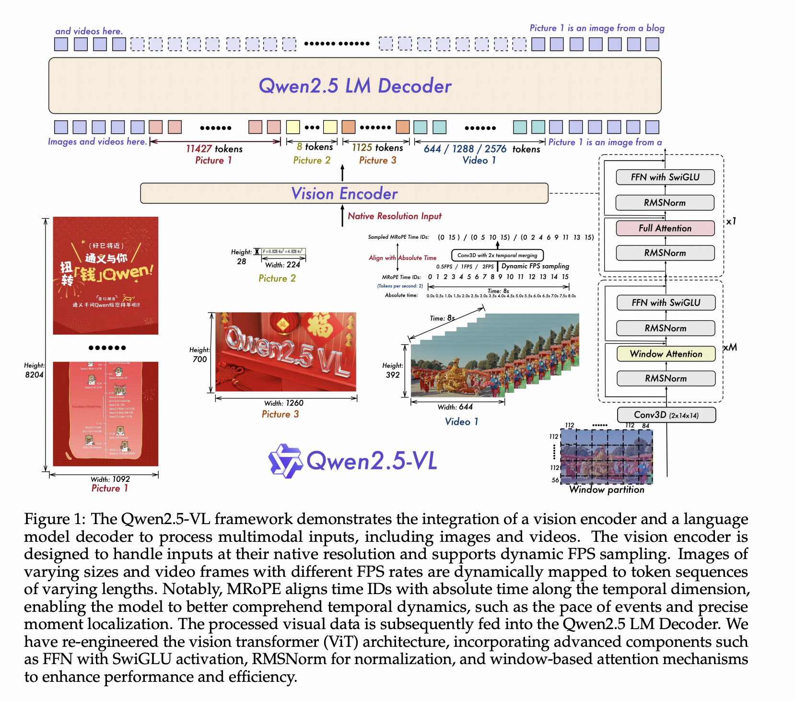 


### GPT系列

### DeepSeek系列

#### DeepSeek-v3

[[2412.19437] DeepSeek-V3 Technical Report](https://arxiv.org/abs/2412.19437)

 

#### DeekSeep-R1

[[2501.12948] DeepSeek-R1: Incentivizing Reasoning Capability in LLMs via Reinforcement Learning](https://arxiv.org/abs/2501.12948)

- 我们直接将RL应用于基础模型，而不依赖监督微调 (SFT) 作为初步步骤。这种方法允许模型探索解决复杂问题的思维链 (CoT)，从而得到DeepSeek-R1-Zero。DeepSeek-R1-Zero展示了自我验证、反思和生成长思维链等能力，标志着研究界的一个重要里程碑。值得注意的是，这是首次公开研究，验证了LLMs的推理能力可以纯粹通过RL来激励，而不需要SFT。

### LLaMA系列

#### LLaMA

[[2302.13971] LLaMA: Open and Efficient Foundation Language Models](https://arxiv.org/abs/2302.13971)

- 只使用了公开数据集进行训练，完全可复现、可分享。
- 预归一化：使用 **RMSNorm**对 Transformer 层的输入进行归一化。
- **SwiGLU **激活函数。
- **RoPE** 位置编码。
- **AdamW** 优化器，**cosine 学习率调度**。

#### LLaMA-3

[The Llama 3 Herd of Models | Research - AI at Meta](https://ai.meta.com/research/publications/the-llama-3-herd-of-models/)

 

  

###   LLaVA系列

#### LLaVA

[[2304.08485] Visual Instruction Tuning](https://arxiv.org/abs/2304.08485)

 

#### LLaVA-1.5

[[2310.03744] Improved Baselines with Visual Instruction Tuning](https://arxiv.org/abs/2310.03744)

 

#### LLaVA-OneVision

[[2408.03326] LLaVA-OneVision: Easy Visual Task Transfer](https://arxiv.org/abs/2408.03326)

 

 

## 推理分割（Reasoning Segmentation）

### LISA（CVPR2024）

[[2308.00692] LISA: Reasoning Segmentation via Large Language Model](https://arxiv.org/abs/2308.00692)

[(43 封私信 / 80 条消息) 论文阅读笔记：LISA: Reasoning Segmentation via Large Language Model - 知乎](https://zhuanlan.zhihu.com/p/656977939)

 

 

#### 贡献点

- 我们介绍了推理分割任务，该任务需要基于隐式人类指令进行推理。这项任务强调了自我推理能力的重要性，这对于构建真正智能的感知系统至关重要。
- 我们建立了一个包含一千多个图像指令对的推理分割 Benchmark：ReasonSeg。对于评估和鼓励社区开发新技术至关重要。
- 我们提出了我们的模型：LISA，它采用嵌入式掩码范例来整合新的分割能力。当在无推理数据集上进行训练时，LISA 在推理分割任务中表现出强大的零样本能力，并通过仅对涉及推理的 239 张图像指令对进行微调而进一步提高了性能。

#### LISA++

 

- 增强分割：添加了实例分割能力，提供了更详细的场景分析以及现有的多区域语义分割。
- 更自然的对话：提高多轮对话的能力，能够将分割结果直接合并到文本响应中，即对话 (SiD) 中的分割。
- 这些改进是通过管理通用分割数据集的现有样本来实现的，旨在专门增强分割和对话技能，而无需结构变化和额外的数据源。 

### SegLLM（ICLR2025）

[[2410.18923] SegLLM: Multi-round Reasoning Segmentation](https://arxiv.org/abs/2410.18923)

 

### LLM-Seg（CVPR2024）

[[2404.08767] LLM-Seg: Bridging Image Segmentation and Large Language Model Reasoning](https://arxiv.org/abs/2404.08767)

 

 

 

### OpenMaskDINO3D

[[2506.04837] OpenMaskDINO3D : Reasoning 3D Segmentation via Large Language Model](https://arxiv.org/abs/2506.04837)

 


### MIRAS

[[2502.09447] Pixel-Level Reasoning Segmentation via Multi-turn Conversations](https://arxiv.org/abs/2502.09447) 


### HyperSeg

https://arxiv.org/abs/2411.17606

 

### See say and segment

[[2312.08366] See, Say, and Segment: Teaching LMMs to Overcome False Premises](https://arxiv.org/abs/2312.08366) 

# 评测指标

## 机器学习

### 二分类

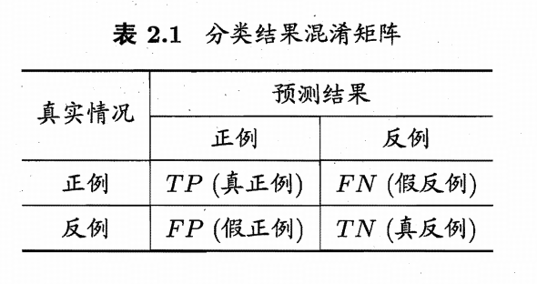 

- 精度/精确率：$acc=\frac{TP+TN}{TP+TN+FP+FN}$
- 准确率/查准率：$\mathrm{Precision}=\frac{TP}{TP+FP}$
- 召回率/查全率：$\mathrm{Recall}=\frac{TP}{TP+FN}$
- F1-score：$F1=\frac{2\cdot \mathrm{Precision}\cdot \mathrm{Recall}}{\mathrm{Precision}+\mathrm{Recall}}=\frac{2TP}{2TP+FP+FN}$
- F-score：$F_\beta = (1 + \beta^2) \cdot \frac{\mathrm{Precision} \cdot \mathrm{Recall}}{(\beta^2 \cdot \mathrm{Precision}) + \mathrm{Recall}}$
- F1-score 是 $\mathrm{Precision}$ 和 $\mathrm{Recall}$ 的调和平均，尽量让两种指标都很高

## 图像生成

### IS

**Inception Score**

- 用于衡量生成图片的清晰度和多样性。
- 使用图片分类器 Inception Net-V3 对生成的图片分类，根据分类器的输出 $y$ 评估生成图片的质量。对于清晰的生成图片，$y$ 的某一维应该接近 1，其他维接近 0。对于多样的生成器，生成的图片应该均匀地分布在 Inception Net 的 1000 个类别中。
- **越大越好**

$\mathrm{IS} = \exp(\mathbb{E}_{x\sim p_g}D_{KL}(\ p(y|x)\|p(y)\ )\ )$

### FID

**Frechet Inception Distance score**

- 用于评估生成模型生成图像的质量。
- 通过比较生成图像和真实图像特征空间中的分布，来衡量图像的质量和多样性。把 Inception Net-V3 的分类头去掉，剩余部分提取图片特征。
- **越小越好**：低 FID 值表示生成图像和真实图像在特征空间的分布更接近，生成图像质量和多样性更好。

$\mathrm{FID}=\|\mu_r-\mu_g\|_2^2+Tr(\sum_r+\sum_g-2(\sum_r\sum_g)^{1/2})$

- $\mu_r$ 和 $\sum_r$ 分布表示真实图像特征 (real) 的均值和协方差矩阵。
- $\mu_g$ 和 $\sum_g$ 分布表示生成图像特征 (generate) 的均值和协方差矩阵。
- $\|\cdot\|_2$ 表示欧几里得范数。
- $Tr$ 表示矩阵的迹 (Trace)。

### PPL

**Perceptual Path Length**


## 自然语言生成(NLG)

### BLEU

**Bilingual Evaluation Understudy**

- 通过计算模型生成文本与一个或多个参考文本之间 n-gram 的重合程度来评估翻译质量。
- 主要关注精确率 (precision)，并引入了 brevity penalty 来惩罚过短的生成结果。

 


## 图像检测

### IoU

### CIoU

### GIoU

## 大语言模型

### 困惑度(perplexity)
