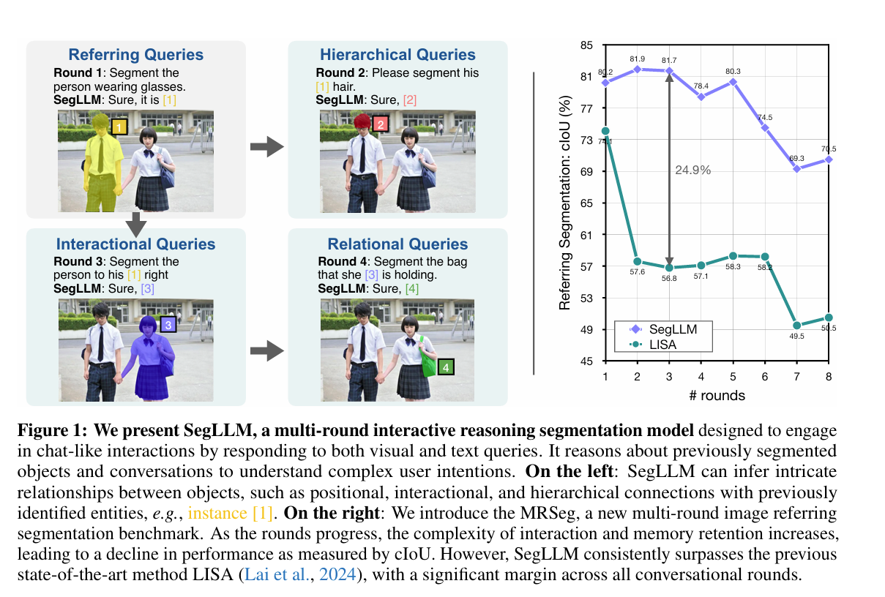
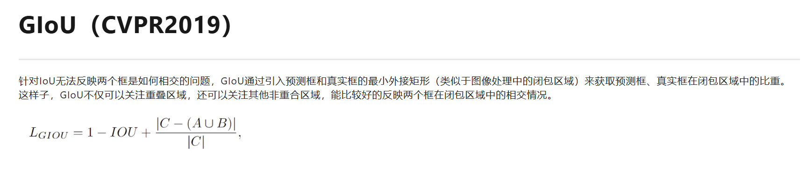
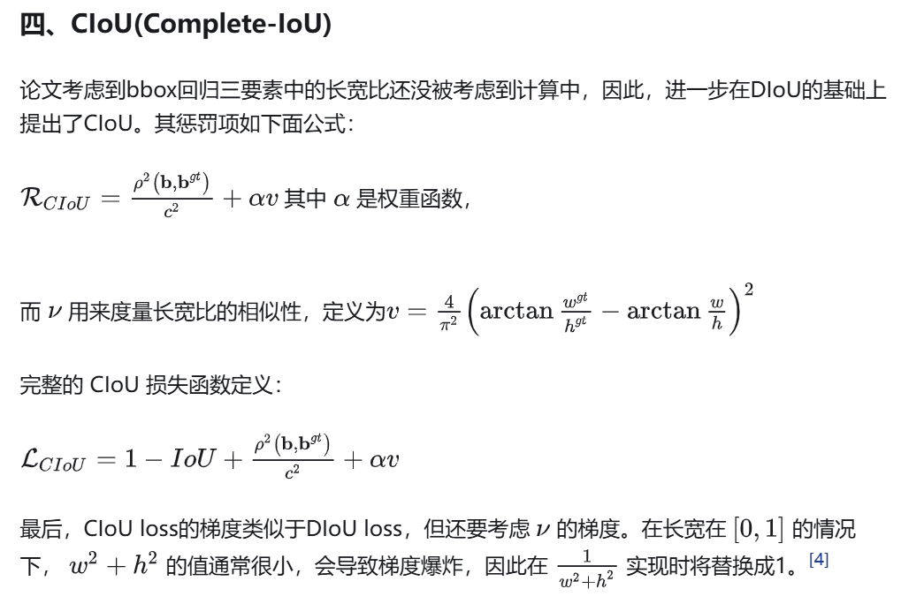

# 多模态大模型推理分割调研

### 华东师范大学 冯中信

### LISA（CVPR2024）

[[2308.00692] LISA: Reasoning Segmentation via Large Language Model](https://arxiv.org/abs/2308.00692)

[(43 封私信 / 80 条消息) 论文阅读笔记：LISA: Reasoning Segmentation via Large Language Model - 知乎](https://zhuanlan.zhihu.com/p/656977939)

 

 

#### 贡献点

- 我们介绍了推理分割任务，该任务需要基于隐式人类指令进行推理。这项任务强调了自我推理能力的重要性，这对于构建真正智能的感知系统至关重要。
- 我们建立了一个包含一千多个图像指令对的推理分割 Benchmark：ReasonSeg。对于评估和鼓励社区开发新技术至关重要。
- 我们提出了我们的模型：LISA，它采用嵌入式掩码范例来整合新的分割能力。当在无推理数据集上进行训练时，LISA 在推理分割任务中表现出强大的零样本能力，并通过仅对涉及推理的 239 张图像指令对进行微调而进一步提高了性能。

#### LISA++

 

- 增强分割：添加了实例分割能力，提供了更详细的场景分析以及现有的多区域语义分割。
- 更自然的对话：提高多轮对话的能力，能够将分割结果直接合并到文本响应中，即对话 (SiD) 中的分割。
- 这些改进是通过管理通用分割数据集的现有样本来实现的，旨在专门增强分割和对话技能，而无需结构变化和额外的数据源。 

### SegLLM（ICLR2025）

[[2410.18923] SegLLM: Multi-round Reasoning Segmentation](https://arxiv.org/abs/2410.18923)

#### 贡献

- 在本文中，我们提出了一种新的VLM体系结构SegLLM，用于广泛的指令跟踪分割任务，擅长以会话方式处理多个视觉和文本查询;
- 我们策划了一个高质量的多轮交互分割数据集MRSeg，具有一组不同的关系、交互和分层多轮交互分割查询。
- 我们在提议的 MRSeg 基准上将 SegLLM 与最先进的模型进行了广泛的基准测试，以及引用表达式理解 (REC)、引用表达式分割 (RES) 和推理分割 (ReasonSeg) 等常规任务。SegLLM在所有这些任务上都实现了最先进的性能 

### LLM-Seg（CVPR2024）

[[2404.08767] LLM-Seg: Bridging Image Segmentation and Large Language Model Reasoning](https://arxiv.org/abs/2404.08767)

#### 贡献点

- 我们引入了LLM-Seg，这是一种为推理分割任务量身定制的一种新颖的两阶段方法。
- 我们开发了一个低成本高效的数据生成管道进行推理分割，利用ChatGPT-4的先进能力。
- 我们提出了LLM-Seg40K，这是一个用于模型训练和评估的大规模推理分割数据集

 

 

 

### OpenMaskDINO3D

[[2506.04837] OpenMaskDINO3D : Reasoning 3D Segmentation via Large Language Model](https://arxiv.org/abs/2506.04837)

 

### MIRAS

[[2502.09447] Pixel-Level Reasoning Segmentation via Multi-turn Conversations](https://arxiv.org/abs/2502.09447) 

### HyperSeg

https://arxiv.org/abs/2411.17606

 

### See say and segment

[[2312.08366] See, Say, and Segment: Teaching LMMs to Overcome False Premises](https://arxiv.org/abs/2312.08366)

## 指标

### GIoU

 

### CIoU

 

### Acc@0.5

置信度为0.5时的准确度