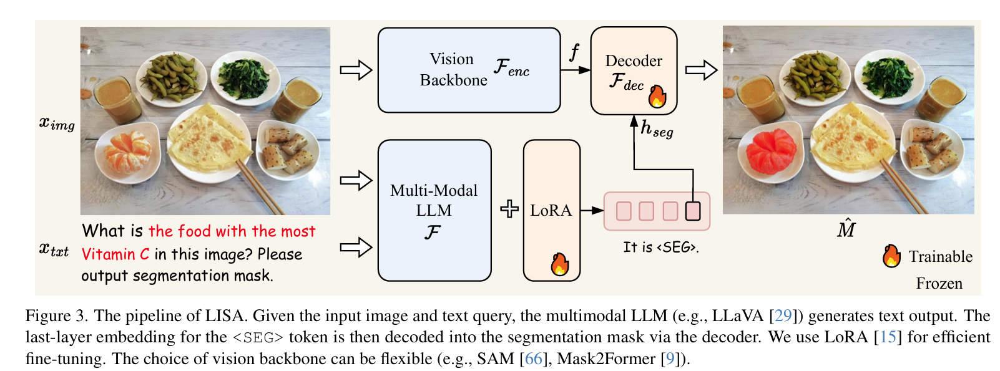

## LISA: Reasoning Segmentation via Large Language Model

[2308.00692](https://arxiv.org/pdf/2308.00692)

[(43 封私信 / 80 条消息) 论文阅读笔记：LISA: Reasoning Segmentation via Large Language Model - 知乎](https://zhuanlan.zhihu.com/p/656977939)

 

## SegLLM: Multi-round Reasoning Segmentation

[arxiv.org/pdf/2410.18923](https://arxiv.org/pdf/2410.18923)

