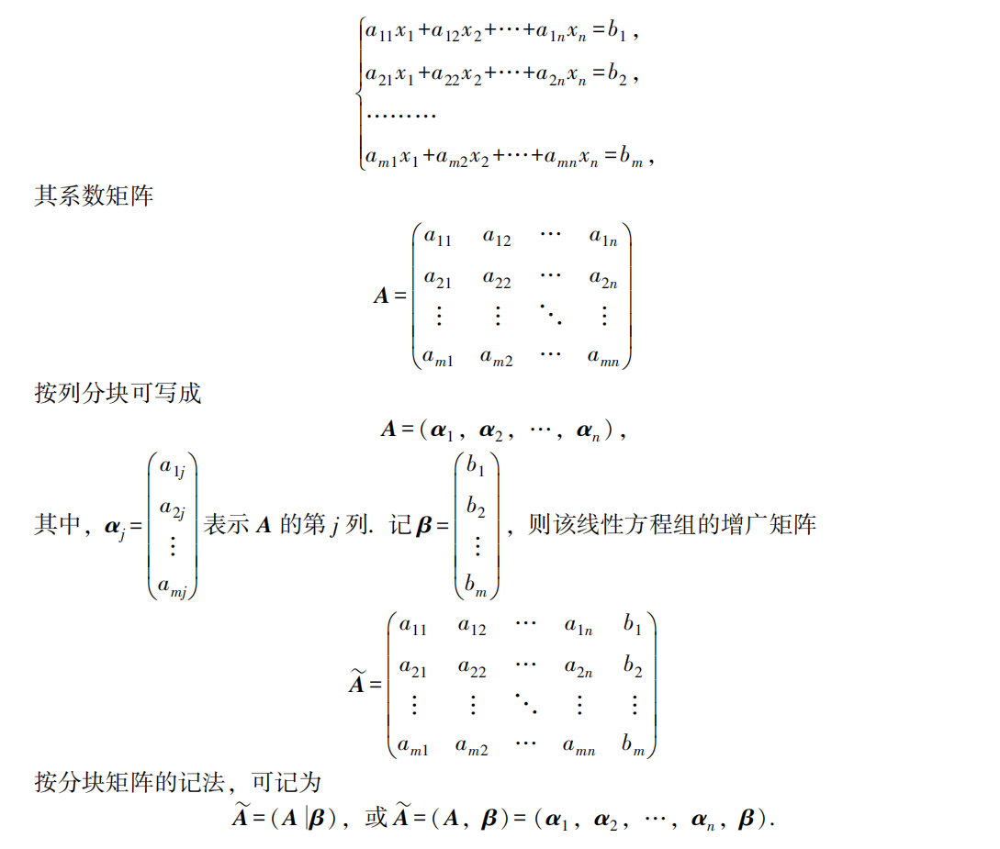

[TOC]

# 操作系统

## 进程管理

### PCB

- PCB(Process Control Block) 是进程控制块。
- PCB 是进程的唯一标识，操作系统调度进程时就是根据每个进程 PCB 中的信息进行调度的，当决定执行 某个进程后，会根据该进程PCB 中保存的信息去恢复上次执行的现场，当分配到的CPU时间片用完 后，需要将当前状态保存到PCB中，以便下次恢复。
- PCB 组织方式： 通过链表的方式组织成一个个队列，拥有相同状态的进程组成一个队列。 比如就绪进程就会组成就绪队列、因为某些事件而阻塞的进程组成阻塞队列。 也可以将相同状态的PCB按照其他策略排成多个链表

 

 

### 死锁

- 死锁是多个进程间彼此持有对方需要的资源，但又在等待对方释放自己需要的资源的状态。

**死锁发生原因：**

- 竞争非剥夺性资源和临时性资源（CPU和内存是可剥夺资源，IO设备是非剥夺资源)。非剥夺资源分配不当、使用未加限制会导致死锁
- 进程推进顺序不当：相似逻辑的程序，指令顺序不相同。

 

 

### CFS(Completely Fair Scheduler)

## 内存管理

### 内存管理的机制

 

 

  

 

## IO 管理

### IO 模型

 

 

  

 

 ### IO 多路复用

 

 

 

 

 

 

 

### 状态处理

 

 

 

### Reactor 模式

 

# 计算机网络

 

# 计算机组成原理

# 数据结构

# 概率论和数理统计

## 随机变量的分布

### 泊松分布

 

  

### 几何分布

 

### 超几何分布

  

### 负二项分布

 

### 指数分布

 

### 正态分布

 

 

 

## 矩

 

## 协方差

$$
\begin{align*}
Cov(X,Y) &= E[(X-E[X])(Y-E[Y])]\\
	&=E[XY]-E[X]E[Y]\\
	p_{xy}&=\frac{Cov(X,Y)}{\sqrt{D(X)}\sqrt{D(Y)}}
\end{align*}
$$

 

## 最大似然估计

 

 $\theta$ 是模型的参数，$x_1,x_2...x_n$ 是 $n$ 次采样得到的结果。 

## 大数定理

 

## 中心极限定理

 

 

# 线性代数

## 矩阵基础

### 对称/反对称矩阵

- $n$ 阶方阵 $A$ 如果满足 $A^T=A$，则 $A$ 是对称矩阵。
- $n$ 阶方阵 $A$ 如果满足 $A^T=-A$，则 $A$ 是反对称矩阵。

### 增广矩阵

 

### 分块对角阵

 

### 阶梯形矩阵/最简形矩阵

 

### 代数余子式

### 线性方程组有解条件

### 逆矩阵

 

 

 

  

### 伴随矩阵

  

### 克莱默法则

 

## 行列式

### 定义

 

   

### 性质

 

 

 

 

 

 

 

  

### 计算

- 计算行列式 $D=\begin{vmatrix}2&1&1&1 \\ 1&2&1&1 \\ 1&1&2&1\\1&1&1&2 \end{vmatrix}$

  - 注意到行列式每一列元素之和都是 $5$，把行列式第 2、3、4 行都加到第一行，得
  - $D=\begin{vmatrix}5&5&5&5 \\ 1&2&1&1 \\ 1&1&2&1\\1&1&1&2 \end{vmatrix}
     =5\begin{vmatrix}1&1&1&1 \\ 1&2&1&1 \\ 1&1&2&1\\1&1&1&2 \end{vmatrix}
     \xlongequal{\begin{align*}r_2-=r_1 \\r_3-=r_1\\r_4-=r_1\end{align*}}
     5\begin{vmatrix}1&1&1&1 \\ 0&1&0&0 \\ 0&0&1&0\\0&0&0&1 \end{vmatrix}
     =5$

 

 

 

   

## 向量组

### 秩

- 向量组 $A$ 的任意一个极大无关组所含向量的个数，称为这个向量组的**秩**，记为 $R_A$ 

### 正交向量组

- 由一组两两正交的非零向量组成的向量组，称为正交向量组。
- 若 $n$ 维向量组 $\alpha_1,\alpha_2,...,\alpha_m$ 是一个正交向量组，则 $\alpha_1,\alpha_2,...,\alpha_m$ 线性无关。

### 正交基和正交化

 

 

### 正交矩阵

- $n$ 阶矩阵 $A$ 满足 $A^TA=E$（即 $A^T=A^{-1}$），则 $A$ 是一个**正交矩阵**，简称正交阵。 
- 对于 $n$ 阶方阵 $A$，以下三个结论等价
  1. $A$ 是 $n$ 阶正交阵。
  2. $A$ 的列向量组是 $\R^n$ 的一个规范正交基。
  3. $A$ 的行向量组是 $\R^n$ 的一个规范正交基。 

## 相似矩阵和二次型

### 特征值/特征向量

**Eigenvalue & Eigenvector**

- 对于 $n$ 阶矩阵 $A$，如果能找到一个**非零向量** $x$ 和实数 $\lambda$ 满足 $Ax=\lambda x$，则 $\lambda$ 是 $A$ 的一个特征值，$x$ 是 $A$ 对应于特征值 $\lambda$ 的特征向量。

**性质：**

1. 矩阵的**特征值之和**等于矩阵的迹

   $\lambda_1 + \lambda_2 + ... +\lambda_n = a_{11}+a_{22}+...+a_{nn}=\mathrm{trace}(A)$

2. 矩阵的**特征值之积**等于矩阵的行列式
3. $\lambda_1 \lambda_2 ...\lambda_n = |A|=\det(A)$
4. $n$ 阶方阵 $A$ 可逆的充要条件是 $A$ 的特征值全不为 0.
5. 如果 $x_1$ 和 $x_2$ 是 $A$ 的同一个特征值 $\lambda$ 对应的特征向量，则 $k_1x_1+k_2x_2$（$k_1,k_2$不同时为0）也是特征值 $\lambda$ 对应的特征向量。
6. 如果 $\lambda_1,\lambda_2,...,\lambda_m$ 是 $A$ 的 $m$ 个互不相同的特征值，$x_1,x_2,...,x_m$ 是对应的特征向量，则 $x_1,x_2,...,x_m$ 线性无关。

 

**几何意义：**

- 对于 $n$ 维向量 $x$，乘上 $n$ 阶方阵 $A$ 相当于进行一次线性变换，$Ax$ 相对于 $x$ 长度和方向都发生了改变。
- 对于特定的矩阵 $A$，总存在一些特定方向的向量 $x$，线性变换后的 $Ax$ 相对于 $x$ 方向没有发生改变，只改变了长度。我们把这样的向量称为矩阵 $A$ 的特征向量，长度变换的系数 $\lambda$ 称为向量对于的特征值。

**复数特征值：**

- 特征值未必是实数，对于 $A=\begin{bmatrix}0&-1\\1&0 \end{bmatrix}$，有 $\det(A-\lambda I)=\begin{vmatrix}0-\lambda&-1\\1&0-\lambda\end{vmatrix}=\lambda^2+1=0$。

  此时特征值是复数，$\lambda=\pm i$.

### 特征多项式

- 将 $Ax=\lambda x$ 改写成 $(A-\lambda I)x=0$，而 $n$ 个未知数 $n$ 个方程的齐次线性方程组 $(A-\lambda I)x=0$ 有非零解，齐次线性方程组存在非零解的充要条件是系数行列式等于 0，即 $|A-\lambda I|=0$
- 记 $f(\lambda)=|A-\lambda I|=\begin{vmatrix}a_{11}-\lambda &a_{12}&...&a_{1n}\\a_{21}&a_{22}-\lambda&...&a_{2n}\\ \vdots&\vdots&\ddots&\vdots\\a_{n1}&a_{n2}&\dots&a_{nn}-\lambda \end{vmatrix}$，则 $f(\lambda)$ 是 $\lambda$ 的 $n$ 阶多项式，称为矩阵 $A$ 的**特征多项式**。方程 $f(\lambda)=0$ 称为 $A$ 的**特征方程**。$A$ 的特征值就是特征方程的根。
- 设 $\lambda_i$ 是 $A$ 的一个特征值，则方程 $(A-\lambda_iI)x=0$ 的非零解 $x=x_i$ 是 $A$ 对于特征值 $\lambda_i$ 的特征向量。

### 相似矩阵

- 设 $A,B$ 都是 $n$ 阶矩阵，若有**可逆矩阵** $P$，使得 $P^{-1}AP=B$，则 $B$ 是 $A$ 的相似矩阵，或者说矩阵 $A$ 和 $B$ 相似。运算 $P^{-1}AP$ 称为对 $A$ 进行相似变换，$P$ 称为把 $A$ 变成 $B$ 的相似变换矩阵。

- 若 $n$ 阶矩阵 $A$ 和 $B$ 相似，则 $A$ 和 $B$ 有**相同的特征多项式**，从而 $A$ 和 $B$ 有相同的特征值。

- 若 $A$ 与对角阵 $\Lambda=\begin{pmatrix}\lambda_1&&&\\&\lambda_2&&\\&&\ddots&\\&&&\lambda_n \end{pmatrix}$ 相似，则 $\lambda_1,\lambda_2,...,\lambda_n$ 是 $A$ 的 $n$ 个特征值。

**相似对角化：**

- 对于 $n$ 阶矩阵 $A$，寻找相似变换矩阵 $P$，使得 $\Lambda=P^{-1}AP$ 为对角阵，称为矩阵 $A$ 的**相似对角化**。
- $n$ 阶矩阵 $A$ 能进行**相似对角化的充要条件**是 $A$ 有 $n$ 个线性无关的特征向量。
- 如果 $A$ 的 $n$ 个特征值互不相等，则 $A$ 与对角阵相似（可对角化）。

### 实对称矩阵

**性质：**

1. 实对称矩阵的特征值为实数。

2. 设 $\lambda_1$ 和 $\lambda_2$ 是对称矩阵 $A$ 的两个特征值且 $\lambda_1\ne \lambda_2$，$x_1$ 和 $x_2$ 是对应的两个特征向量，则 $x_1$ 和 $x_2$ 正交。

   **证明：**$\lambda_1x_1^Tx_2=(\lambda_1x_1)^Tx_2=(Ax_1)^Tx_2=x_1^TA^Tx_2=x_1^TAx_2=\lambda_2x_1^Tx_2$

   即 $(\lambda_1-\lambda_2)x_1^Tx_2=0,\lambda_1\ne\lambda_2\Longrightarrow x_1^Tx_2=0$，$x_1$ 和 $x_2$ 正交。

3. 实对称矩阵 $A$ 必定**正交相似**于实对角阵 $\Lambda$，即存在正交阵 $P$，满足 $P^{-1}AP=P^TAP=\Lambda$，其中 $\Lambda$ 对角线上的元素是 $A$ 的 $n$ 个特征值。

## 二次型和正定性

### 二次型

$$
\begin{align*}
f(x_1,x_2,...,x_n)=a_{11}x_1^2 + 2a_{12}x_1x_2+\dots+2a_{1n}x_1x_n+ \\
a_{22}x_2^2+\dots+2a_{2n}x_2x_n+\\
\dots+\\
a_{nn}x_n^2
\end{align*}
$$

- 含有 $n$ 个变量 $x_1,x_2,...,x_n$ 的**二次齐次多项式** $f(x_1,x_2,...,x_n)$ 被称为**二次型**，如果所有系数 $a_{ij}(1\le i,j\le n)$都为实数，则称为实二次型。
- 如果二次型只有平方项，即 $f(x_1,x_2,\dots,x_n)=k_1x_1^2+k_2x_2^2+...+k_nx_n^2$，则称为二次型的**标准型**。
- 如果标准型的系数只在 $-1,0,1$ 中取值，即 $k_i\in\{-1,0,1\}(1\le i\le n)$，则称为二次型的**规范型**。

### 矩阵的二次型

- 任意一个方阵 $A$ 的二次型定义为 $x^\dagger Ax$，其中 $x$ 是任意非零向量，$x^\dagger$ 表示共轭转置。

- 对于实矩阵 $A$，二次型的计算公式为 $x^TAx=\sum\limits_{i=1}^n{a_{ii}x_i^2}+\sum\limits_{i=1}^{n-1}\sum\limits_{j=i+1}^{n}{(a_{ij}+a_{ji})x_ix_j}$。

- 对于一个二次型函数，对于的矩阵不止一个，例如 $\begin{bmatrix}1&10\\2&1\end{bmatrix}$ 和 $\begin{bmatrix}1&6\\6&1\end{bmatrix}$ 对应的二次型相同。

  由于 $x^TAx=x^T(\frac{1}{2}(A+A^T))x$，为了确保定义的唯一性，通常假设 $A$ 为实对称矩阵或者 Hermite 矩阵。通过这样的约束，二次型和对称阵存在一一对应的关系，**二次型用来刻画矩阵的正定性**。

- 对称阵 $A$ 叫做二次型 $f(x)=x^TAx$ 的矩阵，$f(x)=x^TAx$ 叫做对称阵 $A$ 的二次型。$A$ 的秩叫做二次型 $f(x)=x^TAx$ 的秩。
- 标准型的矩阵是对角阵。 

### 正定矩阵

通过二次型 $x^\dagger Ax$，我们可以得出正定矩阵的定义：对于任意 Hermite 矩阵 $A$

1. $\forall x\ne 0,x^\dagger Ax>0$，则称 $A$ 为正定矩阵。
1. $\forall x\ne 0,x^\dagger Ax\ge0$，则称 $A$ 为半正定矩阵。
1. $\forall x\ne 0,x^\dagger Ax<0$，则称 $A$ 为负定矩阵。
1. $\forall x\ne 0,x^\dagger Ax\le0$，则称 $A$ 为半负定矩阵。
1. 若二次型有正有负，则称 $A$ 为不定矩阵。

**性质：**

1. 若 $A$ 的正定矩阵，则 $A$ 的所有特征值是正实数。
2. 若 $A$ 的半正定矩阵，则 $A$ 的所有特征值是非负实数。
3. 若 $A$ 的负定矩阵，则 $A$ 的所有特征值是负实数。
4. 若 $A$ 的半负定矩阵，则 $A$ 的所有特征值是非正实数。
5. 若 $A$ 的不定矩阵，则 $A$ 有的特征值取正实数，有的特征值取负实数。

## 厄米特矩阵

**Hermitian Matrix，Hermite矩阵**

- 厄米特矩阵指的是**自共轭矩阵**，厄米特矩阵 $A$ 满足 $A_{ij}$ 和 $A_{ji}$ 的共轭相等，即 $A_{ij}=\overline{A_{ji}}$。
- Hermite 矩阵对角线上的元素都是实数。
- 如果矩阵 $A$ 满足 $A=A^{\dagger}$，则 $A$ 是 Hermite 矩阵。对于实矩阵，有 $A^{\dagger}=A^T$，对称矩阵和 Hermite 矩阵等价。

**性质：**

- Hermite 矩阵的**特征值都是实数**。
- Hermite 矩阵任意两个不同特征值对于的**特征向量正交**。
- Hermite 矩阵 A 的所有特征值满足 $\lambda_i>0$，则 A 是正定矩阵。
- Hermite 矩阵 A 的所有特征值满足 $\lambda_i\ge0$，则 A 是半正定矩阵。
- 如果 A 是 Hermite 矩阵，对于正整数 k，$A^k$ 也是 Hermite 矩阵。
- 如果 A 是 Hermite 矩阵且可逆，则 $A^{-1}$ 也是 Hermite 矩阵。 

**共轭转置：**

- $\overline{A}^T$ 表示对矩阵 $A$ 的每个元素取共轭复数（实部不变、虚部取反），然后将矩阵转置。我们把这两个操作合起来称为共轭转置（conjugate transpose），用 $A^{\dagger}$ 表示。
- 两个复数向量 $x,y$ 的内积可以表示成 $x^\dagger y$ ，如果 $x^\dagger y=0$，则这两个向量正交。
- 复数向量 $x$ 的模长为 $\| x\|=(x^\dagger x)^{1/2}$
- $(AB)^{\dagger}=B^\dagger A^\dagger$ 

## 格拉姆矩阵

**（Gram matrix）**

 

令  $A=[\beta_1,\beta_2...\beta_n]$，则 $G = A^TA$

## 海塞矩阵/黑塞矩阵

**（Hessian matrix）**

 

